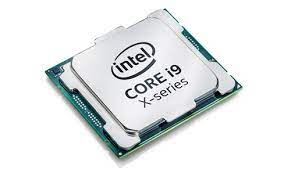
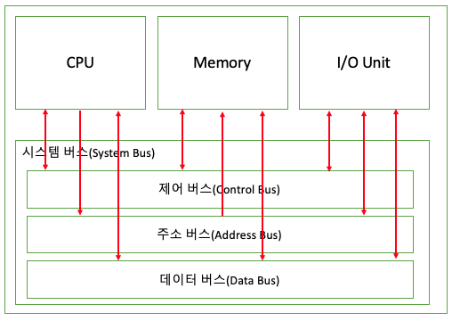

# Computer

## 컴퓨터 란

방대한 정보를 저장하고 처리할 수 있는 전자적 기계 장치로 프로그램을 사용해 정보를 입출력하고 계산을 자동으로 수행하고 텍스트, 그래픽, 심벌, 사운드 등을 처리하도록 프로그래밍할 수 있는 범용장치

## 컴퓨터가 이해하는 두가지

### 데이터

숫자, 문자, 이미지와 같은 정적인 정보 (0, 1 로 이루어진 데이터)

### 명령어

컴퓨터에게 특정 작업을 수행시키기 위한 정보

## 컴퓨터의 핵심 부품

### CPU (Central Process Unit)

컴퓨터 시스템을 통제하고 프로그램의 연산을 실행, 처리하는 가장 핵심적인 컴퓨터의 제어 장치

#### CPU 의 핵심 부품

- ALU (Arithmetic Logic Unit) : 산술 연산과 논리 연산을 수행하는 산술논리장치
- Register : CPU가 요청을 처리하는데 필요한 데이터를 일시적으로 저장하는 장치
- Control Unit : 명령어를 해석하고 실행하기 위한 제어 신호들을 발생시키는 장치
- Internal Bus : ALU, Register 등을 연결하는 버스

### 메모리

프로그램이 실행되는 동안 필요한 정보를 저장하는 장치로 프로그램이 실행되기 위해서는 메모리에 저장되어 있어야 함

메모리에 저장된 정보 (위치) 에는 주소를 통해 접근

전원이 꺼지면 저장된 데이터가 사라짐

### 보조기억장치

실행할 프로그램이나 데이터를 영구적으로 저장할 수 있는 장치

### 입출력장치

컴퓨터와 사용자 사이의 정보를 교환할 수 있는 장치

### 메인보드

시스템을 작동시키는 CPU, 메모리 같은 핵심 부품을 장착할 수 있는 슬롯과 주변 장치를 연결할 수 있는 인터페이스를 제공하는 인쇄회로기판

버스를 통해 컴퓨터의 구성 요소를 서로 연결하고 데이터를 전달하며, 시스템 버스는 컴퓨터 핵심 부품을 연결

