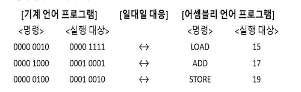

# 소스코드와 명령어

## 저급 언어

컴퓨터가 이해 할 수 있는 언어

명령어로 이루어져 있고 고급 언어로 작성된 소스 코드가 실행되기 위해서는 저급 언어로 변환되어야 함

### 기계어

2진수 또는 16진수로 표현된 언어

### 어셈블리어

기계어를 사람이 읽기 편한 상태로 변환된 언어

## 고급 언어

사람이 이해 할 수 있는 언어 (대부분의 프로그래밍 언어)

### 컴파일 언어

고급 언어가 저급 언어로 변환되는 방법으로 컴파일러에 의해 소스 코드 전체가 저급 언어로 변환되어 실행

- 컴파일 : 컴파일 언어로 장석된 소스 코드가 저급 언어로 변환되는 과정
- 컴파일러 : 컴파일을 수행해 주는 도구
- 목적 코드 : 컴파일러를 통해 저급 언어로 변환된 코드

### 인터프리터 언어

고급 언어가 저급 언어로 변환되는 방법으로 인터프리터에 의해 소스 코드가 한 줄씩 실행되는 고급 언어

- 인터프리터: 소스 코드 한 줄씩 저급 언어로 변환하여 실행해 주는 도구

## 명령어

연산 코드 (행동) + 오퍼랜드 (대상) 으로 이루어져 있음

연산 코드 == 명령어

오퍼랜드 == 연산에 사용될 데이터 혹은 연산에 사용될 데이터가 저장된 위치 (오퍼랜드 필드에 데이터를 명시할 경우 표현 가능한 데이터가 한정적이기 때문에 주소를 명시하는게 효율적)

데이터 전송

- MOVE : 데이터를 옮겨라
- STORE : 메모리에 저장하라
- LOAD(FETCH) : 메모리에서 CPU로 데이터를 가져와라
- PUSH : 스택에 데이터를 넣어라
- POP : 스택의 최상단 데이터를 가져와라

산술/논리 연산

- ADD / SUBSTRACT / MULTIPLY / DIVIDE : 덧셈 / 뺄셈 / 곱셈 / 나눗셈
- INCREMENT / DECREMENT : 오퍼랜드에 1을 더하라 / 오퍼랜드에 1을 빼라
- AND / OR / NOT : and / or / not 연산을 수행하라
- COMPARE : 두 개의 숫자 또는 TRUE / FALSE 값을 비교해라

제어 흐름 변경

- JUMP : 특정 주소로 실행 순서를 옮겨라
- CONDITIONJUMP : 조건에 부합할 때 특정 주소로 실행 순서를 옮겨라
- HALT : 프로그램의 실행을 멈춰라
- CALL : 되돌아올 주소를 저장한 채 특정 주소로 실행 순서를 옮겨라
- RETURN : CALL을 호출할 때 저장했던 주소로 돌아가라

입출력 제어

- READ (INPUT) : 특정 입출력 장치로부터 데이터를 읽어라
- WRITE (OUTPUT) : 특정 입출력 장치로 데이터를 써라
- START IO : 입출력 장치를 시작하라
- TEST IO : 입출력 장치의 상태를 확인하라

### 명령어 주소 지정 방식

즉시 주소 지정 방식: 연산에 사용할 데이터를 오퍼랜드 필드에 직접 명시

직접 주소 지정 방식: 오퍼랜드 필드에 유효 주소를 직접적으로 명시

간접 주소 지정 방식: 유효 주소의 주소를 오퍼랜드 필드에 명시

레지스터 주소 지정 방식: 연산에 사용할 데이터를 저장한 레지스터를 오퍼랜드 필드에 직접 명시

레지스터 간접 주소 지정 방식: 유효 주소를 저장한 레지스터를 오퍼랜드 필드에 명시
