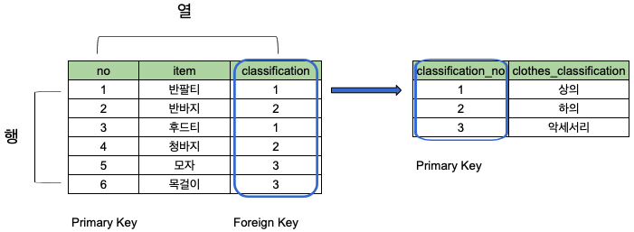
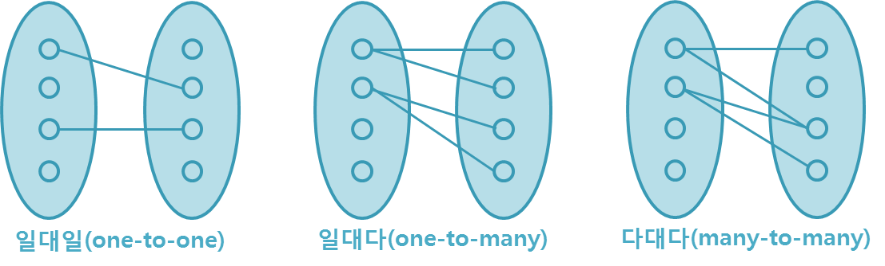

# DB (DataBase)

## DB 란

데이터의 집합 또는 저장소

## DBMS (DataBase Management System) 란

데이터베이스를 운영, 관리하는 시스템 (오라클, mysql 등)

## RDM & RDBMS (Relational DataBase & Relational DataBase Management System) 란

- RDB : 관계형 데이터의 집합, key 와 value 의 관계를 테이블화 (2차원 형태) 한 것
- RDBMS : 관계형 데이터베이스를 운영, 관리하는 시스템으로 table 이라는 최소 단위로 구성되어 있음
- table : 행 (row, recore, tuple) 과 열 (column, field, attribute) 로 이루어진 데이터 저장 단위
- 행 (row, recore, tuple) : 관계된 데이터의 묶음
- 열 (column, field, attribute) : 유일한 이름을 가지며 필드의 데이터 타입 (정수, 텍스트 등) 지정 가능
- Primary Key : table 에서 행의 식별자로 이용되는 열을 Key 또는 Primary Key (식별이 되어야 하기에 중복이 없는 유일한 값이어야 함)
- Foreign Key : table 의 필드 중 다른 table 의 행을 식별할 수 있는 key

### table 간의 관계

## 리스트

- [SQL](https://github.com/sotthang/TIL/blob/main/db/sql.md)
  - [CREATE](https://github.com/sotthang/TIL/blob/main/db/sql_create.md)
  - [DROP](https://github.com/sotthang/TIL/blob/main/db/sql_drop.md)
  - [INSERT](https://github.com/sotthang/TIL/blob/main/db/sql_insert.md)
  - [SELECT 1](https://github.com/sotthang/TIL/blob/main/db/sql_select_1.md)
  - [SELECT 2](https://github.com/sotthang/TIL/blob/main/db/sql_select_2.md)
  - [ALTER](https://github.com/sotthang/TIL/blob/main/db/sql_alter.md)
  - [UPDATE](https://github.com/sotthang/TIL/blob/main/db/sql_update.md)
  - [DELETE](https://github.com/sotthang/TIL/blob/main/db/sql_delete.md)
  - [JOIN](https://github.com/sotthang/TIL/blob/main/db/sql_join.md)
  - [Subquery](https://github.com/sotthang/TIL/blob/main/db/sql_subquery.md)
  - [TRANSACTION](https://github.com/sotthang/TIL/blob/main/db/sql_transaction.md)
  - [TRIGGER](https://github.com/sotthang/TIL/blob/main/db/sql_trigger.md)
  - [Normalization](https://github.com/sotthang/TIL/blob/main/db/sql_normalization.md)
  - [ERD](https://github.com/sotthang/TIL/blob/main/db/sql_erd.md)
- [NoSQL](https://github.com/sotthang/TIL/blob/main/db/nosql.md)

