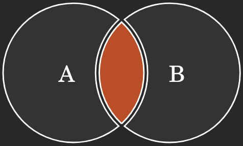
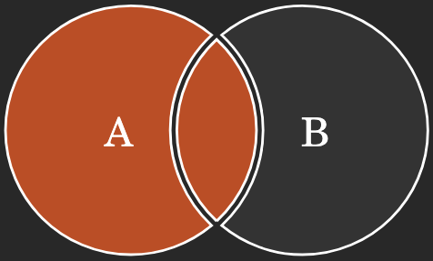
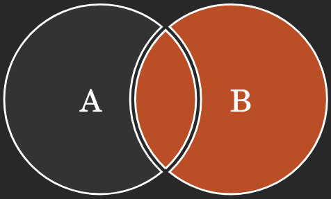
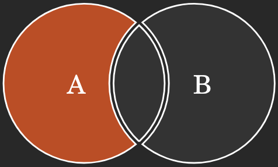
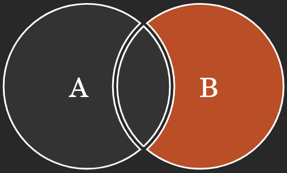
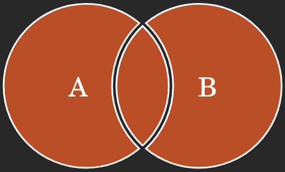
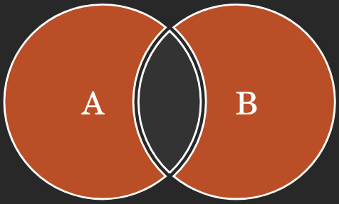

# SQL JOIN

users

|id|name|city|
|-|-|-|
|1|John|Seoul|
|2|Sin|Seoul|
|3|David|Seoul|
|4|Mary|Busan|
|5|Peter|Busan|

articles

|id|title|content|userID|
|-|-|-|-|
|1|dog|dog is good|1|
|2|cat|cat is cute|2|
|3|dog|dog is happy|1|
|4|dog|dog is fantastic|3|
|5|dog|dog is wow|6|

## Table INNER JOIN

```sql
SELECT * FROM articles INNER JOIN users ON articles.userID = users.id;
```

|id|title|content|userID|id|name|city|
|-|-|-|-|-|-|-|
|1|dog|dog is good|1|1|John|Seoul|
|2|cat|cat is cute|2|2|Sin|Seoul|
|3|dog|dog is happy|1|1|John|Seoul|
|4|dog|dog is fantastic|3|3|David|Seoul|

```sql
SELECT title, content, name FROM articles INNER JOIN users ON articles.userID = users.id;
```

|title|content|name|
|-|-|-|
|dog|dog is good|John|
|cat|cat is cute|Sin|
|dog|dog is happy|John|
|dog|dog is fantastic|David|

## Table LEFT JOIN

```sql
SELECT title, content, name FROM articles LEFT JOIN users ON articles.userID = users.id;
```

|title|content|name|
|-|-|-|
|dog|dog is good|John|
|cat|cat is cute|Sin|
|dog|dog is happy|John|
|dog|dog is fantastic|David|
|dog|dog is wow||

dog is wow 작성자는 찾을 수 없음

## Table RIGHT JOIN

```sql
SELECT title, content, name FROM articles RIGHT JOIN users ON articles.userID = users.id;
```

|title|content|name|
|-|-|-|
|dog|dog is good|John|
|cat|cat is cute|Sin|
|dog|dog is happy|John|
|dog|dog is fantastic|David|
|||Mary|
|||Peter|

Mary, Peter 는 작성한 글 없음

## JOIN 정리

```sql
SELECT * FROM TableA A
INNER JOIN TableB B ON A.key = B.key
```



```sql
SELECT * FROM TableA A
LEFT JOIN TableB B ON A.key = B.key
```



```sql
SELECT * FROM TableA A
RIGHT JOIN TableB B ON A.key = B.key
```



```sql
SELECT * FROM TableA A
LEFT JOIN TableB B ON A.key = B.key WHERE B.key IS NULL
```



```sql
SELECT * FROM TableA A
RIGHT JOIN TableB B ON A.key = B.key WHERE A.key IS NULL
```



```sql
SELECT * FROM TableA A
FULL OUTER JOIN TableB B ON
A.key = B.key
```



```sql
SELECT * FROM TableA A
FULL OUTER JOIN TableB B ON
A.key = B.key WHERE A.key IS NULL
OR B.key IS NULL
```


