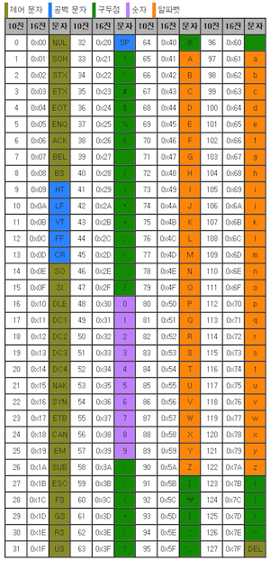
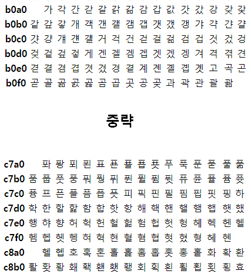
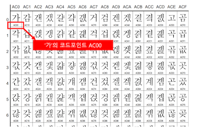
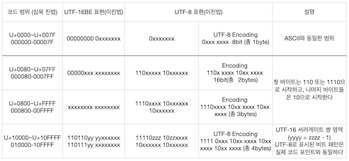

# 컴퓨터가 0과 1로 문자를 표현하는 방법

이진법을 사용하여 표현

## 문자 집합

컴퓨터가 이해할 수 있는 문자의 모음

## 인코딩

사용자가 입력한 문자나 기호들을 컴퓨터가 이용할 수 있는 신호로 만드는 것 (문자열을 바이트로 변환)

## 디코딩

인코딩 전으로 되돌리는 것 (바이트를 문자열로 변환)

## 아스키코드 (ASCII)

영문 알파벳을 사용하는 대표적인 문자 인코딩 (8비트)

7비트는 하나의 문자를 표현하며 1비트는 오류 검출용 (parity bit)

7비트로는 128개보다 많은 문자 (한글 등) 를 표현할 수 없기에 별도 인코딩 방식이 필요

## EUC-KR

완성형 한글 인코딩으로 모든 글자에 2바이트(16진수) 크기의 코드 부여

2300 여개의 한글 표현 가능 (모든 한글을 표현 할 수 없음)

## Unicode

조합형 인코딩으로 영어, 한글, 특수 기호, 이모티콘 등 표현 가능

## UTF (Unicode Transformation Format)

Unicode 를 인코딩하는 방식

### UTF-8

가변 길이 문자 인코딩 방식 중 하나로 8비트 단위로 인코딩하며 유니코드 한 문자를 나타내기 위해 1byte ~ 4byte까지를 사용

영문 byte 수 : 1byte

한글 byte 수 : 3byte

### UTF-16

16비트 단위로 인코딩하며 유니코드 한 문자를 나타내기 위해 2byte ~ 4byte까지를 사용

영문 byte 수 : 2byte

한글 byte 수 : 2byte

