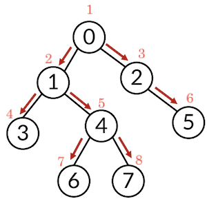

# BFS (Breadth First Search)

## BFS 란

너비 우선 탐색으로 인접한 노드부터 탐색하는 알고리즘

방문한 노드를 재방문 하지 않음

인접한 노드가 여러 개라면 한번에 다 넣음

일반적으로 큐 알고리즘을 사용하기에 선입선출



### deque 로 구현

```python
from collections import deque

def bfs(start):
    queue = deque([start])
    visited[start] = 1
    while queue:
        cur = queue.popleft()
        print(cur)
        for adj in graph[cur]:
            if not visited[adj]:
                queue.append(adj)
                visited[adj] = 1
    return visited
    
n = 8
visited = [0] * n
graph = [
    [1, 2],
    [0, 3, 4],
    [0, 5],
    [1],
    [1, 6, 7],
    [2],
    [4],
    [4]
]
print(bfs(0))

>>> 0    # 탐색 순서
    1
    2
    3
    4
    5
    6
    7
    [1, 1, 1, 1, 1, 1, 1, 1]    # 탐색한 노드 == 1
```


