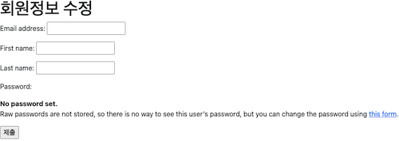

# Django Authentication System

사용자 인증과 관련된 기능을 모아 놓은 시스템으로 인증, 권한 부여를 함께 제공 및 처리


## Accounts App 생성

```python
# accounts/urls.py

from django.urls import path
from . import views

app_name = 'accounts'
urlpatterns = [

]
```

```python
# project/urls.py

urlpatterns = [
    ...,
    path('accounts/', include('accounts.urls')),
]
```

## Custom User Model

Django 에서 기본적으로 제공하는 User Model 은 내장된 auth 모듈의 User 클래스 사용

별도 설정없이 사용 할 수 있으나 custom 불가

makemigrations 이후에는 변경 불가하므로 사전에 작업 필수

```python
# accounts/models.py

from django.contrib.auth.models import AbstractUser

class User(AbstractUser):
    pass
```

```python
# settings.py

AUTH_USER_MODEL = 'accounts.User'
# 기본 값은 auth.User
```

```python
# accounts/admin.py

from django.contrib import admin
from django.contrib.auth.admin import UserAdmin
from .models import User

admin.site.register(User, UserAdmin)
```

## Login

```python
# accounts/urls.py

app_name = 'accounts'
urlpatterns = [
    path('login/', views.login, name='login'),
]
```

```python
# accounts/views.py

from django.contrib.auth.forms import AuthenticationForm
from django.shortcuts import render, redirect
from django.contrib.auth import login as auth_login


def login(request):
    if request.method == 'POST':
        form = AuthenticationForm(request, request.POST)
        if form.is_valid():
            auth_login(request, form.get_user())
            return redirect('accounts:index')
    else:
        form = AuthenticationForm()
    context = {
        'form': form,
    }
    return render(request, 'accounts/login.html', context)
```

```html
<!-- accounts/login.html -->

<h1>로그인</h1>
<form action="" method="POST">
  
  {{ form.as_p }}
  <input type="submit">
</form>
```

```html
<!-- accounts/index.html -->

<h1>index</h1>
<a href="">Login</a>
```


## Logout

```python
# accounts/urls.py

app_name = 'accounts'
urlpatterns = [
    path('login/', views.login, name='login'),
    path('logout/', views.logout, name='logout'),
]
```

```python
# accounts/views.py

from django.contrib.auth import logout as auth_logout

def logout(request):
    auth_logout(request)
    return redirect('accounts:index')
```

```html
<!-- accounts/index.html -->

<h3>Hello, {{ user }}</h3>  <!-- 현재 로그인 유저 정보 출력 -->
<a href="">Login</a>
<form action="" method="POST">
  
  <input type="submit" value="Logout">
</form>
```


## Join

```python
# accounts/urls.py

app_name = 'accounts'
urlpatterns = [
    ...,
    path('signup/', views.signup, name='signup'),
]
```

```python
# accounts/views.py

from django.contrib.auth.forms import UserCreationForm
from .forms import CustomUserCreationForm

def signup(request):
    if request.method == 'POST':
        form = CustomUserCreationForm(request.POST)
        if form.is_valid():
            user = form.save()
            auth_login(request, user)   # 회원가입 후 로그인까지 진행
            return redirect('accounts:index')
    else:
        form = CustomUserCreationForm()
    context = {
        'form': form,
    }
    return render(request, 'accounts/signup.html', context)
```

```html
<!-- accounts/signup.html -->

<h1>회원가입</h1>
<form action="" method="POST">
  
  {{ form.as_p }}
  <input type="submit">
</form>
```

```python
# accounts/forms.py

from django.contrib.auth import get_user_model
from django.contrib.auth.forms import UserCreationForm, UserChangeForm


class CustomUserCreationForm(UserCreationForm):
    class Meta(UserCreationForm.Meta):
        model = get_user_model()


class CustomUserChangeForm(UserChangeForm):
    class Meta(UserChangeForm.Meta):
        model = get_user_model()
```


## Quit (user delete)

```python
# accounts/urls.py

app_name = 'accounts'
urlpatterns = [
    ...,
    path('delete/', views.delete, name='delete'),
]
```

```html
<!-- accounts/index.html -->

<form action="" method="POST">
  
  <input type="submit" value="회원탈퇴">
</form>
```

```python
# accounts/views.py

def delete(request):
    request.user.delete()   # 탈퇴하면서 세션 정보도 삭제
    return redirect('accounts:index')
```

## Edit (update)

```python
# accounts/urls.py

app_name = 'accounts'
urlpatterns = [
    ...,
    path('update/', views.update, name='update'),
]
```

```html
<!-- accounts/update.html -->

<h1>회원정보 수정</h1>
<form action="" method="POST">
  
  {{ form.as_p }}
  <input type="submit">
</form>
```

```python
# accounts/views.py

from .forms import CustromUserChangeForm

def update(request):
    if request.method == 'POST':
        form = CustomUserChangeForm(request.POST, instance=request.user)
        if form.is_valid():
            form.save()
            return redirect('accounts:index')
    else:
        form = CustomUserChangeForm(instance=request.user)
    context = {
        'form': form,
    }
    return render(request, 'accounts/update.html', context)
```


사용자가 접근해서는 안되는 정보까지 수정이 가능해지므로 CustomUserChangeForm 에서 수정 가능한 필드 선언 필요

```python
# accounts/forms.py
class CustomUserChangeForm(UserChangeForm):
    class Meta(UserChangeForm.Meta):
        model = get_user_model()
        fields = ('email', 'first_name', 'last_name',)
```



## Edit Password

Django 에서 비밀번호 변경 페이지는 별도 주소로 안내

/account/passsword/

```python
# accounts/urls.py

app_name = 'accounts'
urlpatterns = [
    ...,
    path('password/', views.change_password, name='change_password'),
]
```

```html
<!-- accounts/change_password.html -->

<h1>비밀번호 변경</h1>
<form action="" method="POST">
  
  {{ form.as_p }}
  <input type="submit">
</form>
```

```python
# accounts/views.py

from django.contrib.auth.forms import PasswordChangeForm
from django.contrib.auth import update_session_auth_hash

def change_password(request):
    if request.method == 'POST':
        form = PasswordChangeForm(request.user, request.POST)
        if form.is_valid():
            user = form.save()
            update_session_auth_hash(request, user) # 암호 변경 시 세션 무효화 방지
            return redirect('accounts:index')
    else:
        form = PasswordChangeForm(request.user)
    context = {
        'form': form,
    }
    return render(request, 'change_password.html', context)
```

## 사용자 접근 제어

로그인 한 사용자만 update, logout 등 만 사용해야 하고 로그인 안한 사용자는 사용해서는 안됨

### is_authenticated

```html
<!-- accounts/index.html -->


  <h3>Hello, {{ user }}</h3>
  <form action="" method="POST">
    
    <input type="submit" value="Logout">
  </form>
  <form action="" method="POST">
    
    <input type="submit" value="회원탈퇴">
  </form>
  <a href="">회원정보수정</a>

  <a href="">Login</a>
  <a href="">Signup</a>

```

```python
# accounts/views.py

def login(request):
    if request.user.is_authenticated:
        return redirect('accounts:index')
    ...


def signup(request):
    if request.user.is_authenticated:
        return redirect('accounts:index')
    ...
```

### login_required

로그인한 사용자에게만 view 함수를 실행시키는 데코레이터

로그인 안한 사용자는 /accounts/login/ 주소로 redirect

```python
# accounts/views.py

from django.contrib.auth.decorators import login_required

@login_required
def logout(request):
    ...


@login_required
def delete(request):
    ...


@login_required
def update(request):
    ...


@login_required
def change_password(request):
    ...
```
