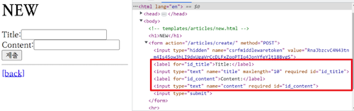
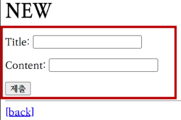
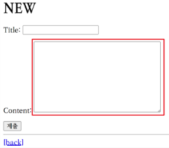
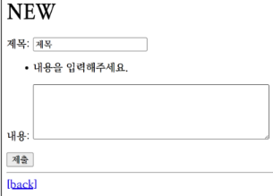
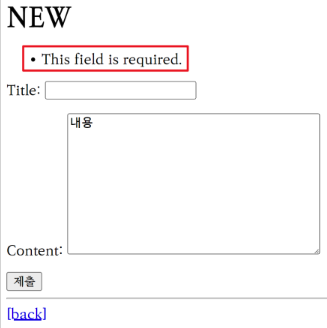

# Django Form

사용자 입력 데이터를 수집, 처리 및 유효성 검증을 수행하는 도구

## Form

``` python
# articles/forms.py

from django import forms

class ArticleForm(forms.Form):
    title = forms.CharField(max_length=10)
    content = forms.CharField()
```

```python
# articles/views.py

from .forms import ArticleForm

def new(request):
    form = ArticleForm()
    context = {
        'form': form,
    }
    return render(request, 'articles/new.html', context)
```

```html
<!-- articles/new.html -->

<h1>NEW</h1>
<form action="" method="POST">
  
  {{ form }}
  <input type="submit">
</form>
```



## Form Rendering Options

```html
<!-- articles/new.html -->

<h1>NEW</h1>
<form action="" method="POST">
  
  {{ form.as_p }}
  <input type="submit">
</form>
```



## Widgets

HTML input element 의 표현 담당

```python
# articles/forms.py

class ArticleForm(forms.Form):
    title = forms.CharField(max_length=10)
    content = forms.CharField(widget=forms.Textarea)
```



### Widgets 응용

```python
# articles/forms.py

class ArticleForm(forms.Form):
    title = forms.CharField(
        label = '제목',
        widget = forms.TextInput(
            attrs = {
                'class': 'my-title',
                'placeholder': 'Enter the title',
                'maxlength': 10,
            }
        ),
    )
    content = forms.CharField(
        label = '내용',
        widget = forms.Textarea(
            attrs = {
                'class': 'my-content',
                'placeholder': 'Enter the content',
                'rows': 5,
                'cols': 50,
            }
        ),
        error_messages = {'required': '내용을 입력해주세요.'}
    )
```



## ModelForm

Form : 로그인처럼 사용자 입력 데이터를 DB 에 저장하지 않을 때

ModelForm : 회원가입처럼 사용자 입력 데이터를 DB 에 저장할 때

```python
# articles/forms.py

from django import forms
from .models import Article

class ArticleForm(forms.ModelForm):
    class Meta:
        model = Article
        fields = '__all__'
        # fileds = ('title', )     모델에서 포함 할 필드 설정
        # exclude = ('title', )    모델에서 포함하지 않을 필드 설정
```

```python
# articles/views.py

from .forms import ArticleForm

def create(request):
    form = ArticleForm(request.POST)
    if form.is_valid():     # is_valid : 유효성 검사 실행 후 유효한 데이터인지 boolean 으로 반환
        article = form.save()
        return redirect('articles:detail', article.pk)
    context = {
        'form': form,
    }
    return render(request, 'articles/new.html', context)
```



```python
# articles/views.py

def edit(request, pk):
    article = Article.objects.get(pk=pk)
    form = ArticleForm(instance=article)
    context = {
        'article': article,
        'form': form,
    }
    return render(request, 'articles/edit.html', context)


def update(request, pk):
    article = Article.objects.get(pk=pk)
    form = ArticleForm(request.POST, instance=article)
    if form.is_valid():
        form.save()
        return redirect('articles:detail', article.pk)
    context = {
        'form': form,
    }
    return render(request, 'articles/edit.html', context)
```

```html
<!-- articles/edit.html -->

<h1>EDIT</h1>
<form action="" method="POST">
  
  {{ form.as_p }}
  <input type="submit">
</form>
```

## save()

```python
# Create
form = ArticleForm(request.POST)
form.save()

# Update
form = ArticleForm(request.POST, instance=article)
form.save()
```
