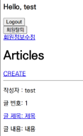
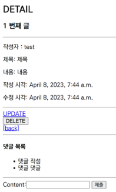
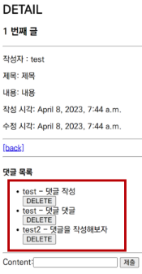

# Django Many to One Relationship

하나의 테이블에서 0개 이상의 레코드가 다른 테이블의 레코드 한 개와 관련된 관계

N:1 or 1:N

article(1) - comment(N) : 1개의 게시글에는 0개 이상의 댓글을 작성 가능

comment

|id|
|-|
|content|
|created_at|
|updated_at|
|article_id|

article

|id|
|-|
|title|
|content|
|created_at|
|updated_at|

## comment 설정

```python
# articles/models.py

class Comment(models.Model):
    article = models.ForeignKey(Article, on_delete=models.CASCADE)
    # ForeignKey(참조 모델 class 이름, 참조 모델 class 삭제 시 동작 방법)
    # CASCADE - 참조 된 객체가 삭제 됐을 때 같이 삭제
    content = models.CharField(max_length=200)
    created_at = models.DateTimeField(auto_now_add=True)
    updated_at = models.DateTimeField(auto_now=True)
```

```cmd
python manage.py makemigrations
python manage.py migrate
```

## 댓글 작성 및 출력

```python
# articles/forms.py

from .models import Article, Comment

class CommentForm(forms.ModelForm):
    class Meta:
        model = Comment
        fields = ('content',)
        # article 은 사용자에게 입력 받는 것이 아닌 view 함수 내에서 별도 처리
```

```python
# articles/views.py

from .forms import ArticleForm, CommentForm

def detail(request, pk):
    article = Article.objects.get(pk=pk)
    comment_form = CommentForm()
    comments = article.comment_set.all()
    context = {
        'article': article,
        'comment_form': comment_form,
        'comments': comments,
    }
    return render(request, 'articles/detail.html', context)


def comments_create(request, pk):
    article = Article.objects.get(pk=pk)
    comment_form = CommentForm(request.POST)
    if comment_form.is_valid():
        comment = comment_form.save(commit=False)
        comment.article = article
        comment_form.save()
        return redirect('articles:detail', article.pk)
    context = {
        'article': article,
        'comment_form': comment_form,
    }
    return render(request, 'article/detail.html', context)
```


```python
# articles/urls.py

urlpatterns = [
    ...
    path('<int:pk>/commments/', views.comments_create, name='comments_create'),
]
```

```html
<!-- articles/detail.html -->

<form action="" method="POST">
    
    {{ comment_form }}
    <input type="submit">
</form>

<ul>
  
    <li>{{ comment.content }}</li>
  
</ul>
```

## 댓글 삭제

```python
# articles/urls.py

urlpatterns = [
    ...
    path('<int:pk>/commments/<int:comment_pk>/delete/', views.comments_delete, name='comments_delete'),
]
```

```python
# articles/views.py

def comments_delete(request, article_pk, comment_pk):
    comment = Comment.objects.get(pk=comment_pk)
    comment.delete()
    return redirect('articles:detail', article_pk)
```

```html
<!-- articles/detail.html -->

<ul>
  
    <li>
      {{ comment.content }}
      <form action="" method="POST">
        
        <input type="submit" value="DELETE">
      </form>
    </li>
  
</ul>
```

## 작성자만 게시글 수정, 삭제 가능

```python
# articles/modles.py

from django.conf import settings

class Article(models.Model):
    user = models.ForeignKey(settings.AUTH_USER_MODEL, on_delete=models.CASCADE)
    ...
```

```cmd
python manage.py makemigrations
<!-- 1 입력 후 엔터 두번 반복 -->
python manage.py migrate
```

```python
# articles/forms.py

class ArticleForm(forms.ModleForm):
    class Meta:
        model = Article
        fields = ('title', 'content',)
```

```python
# articles/views.py

@login_required
def create(request):
    if request.method == 'POST':
        form = ArticleForm(request.POST)
        if form.is_valid():
            article = form.save(commit=False)
            article.user = request.user
            article.save()
            return redirect('article:detail', article.pk)
    else:
        ...


@login_required
def update(request, pk):
    article = Article.objects.get(pk=pk)
    if request.user == article.user:   # 작성자와 수정 요청자가 같은 경우
        if request.method == 'POST':
            form = ArticleForm(request.POST, instance=article)
            if form.is_valid():
                form.save()
                return redirect('article:detail', article.pk)
        else:
            form = ArticleForm(instance=article)
    else:
      return redirect('article:index')


@login_required
def delete(request, pk):
    article = Article.objects.get(pk=pk)
    if request.user == article.user:  # 작성자와 삭제 요청자가 같은 경우
        article.delete()
    return redirect('article:index')
```

```html
<!-- articles/index.html -->


  <p>작성자 : {{ article.user }}</p>
  ...
```



```html
<!-- articles/update.html -->

<p>작성자 : {{ article.user }}</p>
```



```html
<!-- articles/detail.html -->


  <a href="">UPDATE</a><br>
  <form action="" method="POST">
    
    <input type="submit" value="DELETE">
  </form>
<% endif %>
```

## 작성자만 댓글 수정, 삭제 가능

```python
# articles/models.py

class Comment(models.Model):
    user = models.ForeignKey(settings.AUTH_USER_MODEL, on_delete=models.CASCADE)
    ...
```

```cmd
python manage.py makemigrations
<!-- 1 입력 후 엔터 두번 반복 -->
python manage.py migrate
```

```python
# articles/views.py

def comments_create(request, pk):
    article = Article.objects.get(pk=pk)
    comment_form = CommentForm(request.POST)
    if comment_form.is_valid():
        comment = comment_form.save(commit=False)
        comment.article = article
        comment.user = request.user
        comment_form.save()
        return redirect('articles:detail', article.pk)
    ...
```



```python
# articles/views.py

def comments_delete(request, article_pk, comment_pk):
    comment = Comment.objects.get(pk=comment_pk)
    if reqeust.user == comment.user:  # 작성자와 삭제 요청자가 같은 경우
        comment.delete()
    return redirect('article:detail', article_pk)
```

```html
<!-- articles/detail.html -->

<ul>

  <li>
    {{ comment.user }} - {{ comment.content }}
       <!-- 댓글 작성자만 삭제 버튼 보이도록 -->
      <form action="" method="POST">
        
        <input type="submit" value="DELETE">
      </form>
    
  </li>

</ul>
```
