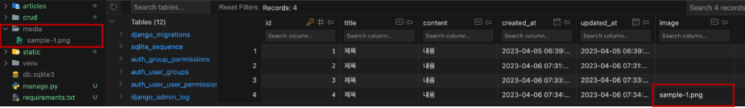

# Django Media Files

사용자가 웹에서 업로드하는 정적 파일

## 사전 준비

```python
# settings.py

# 미디어 파일들이 위치하는 절대 경로
MEDIA_ROOT = BASE_DIR / 'media'

# 미디어 파일의 주소 (URL) 생성
MEDIA_URL = '/media/'
```

```python
# articles/models.py

class Article(models.Model):
    ...
    image = models.ImageField(blank=True)
    # image = models.ImageField(blank=True, upload_to='images/') 로 경로 설정 가능
```

```cmd
pip install pillow

python manage.py makemigrations
python manage.py migrate

pip freeze > requirements.txt
```

## 파일 수정

```python
# crud/urls.py

from django.conf import settings
from django.conf.urls.static import static

urlpatterns = [
    ...
] + static(settings.MEDIA_URL, document_root=settings.MEDIA_ROOT)
```

```html
<!-- articles/create.html -->

<h1>create</h1>
<form action="" method="POST" enctype="multipart/form-data">
    
    {{ form.as_p }}
    <input type="submit">
</form>
```

```python
# articles/views.py

def create(request):
    if request.method == 'POST':
        form = ArticleForm(request.POST, request.FILES)
    ...
```



DB 에는 파일이 아닌 경로가 저장됨

## 업로드 된 이미지 확인

```html
<!-- articles/detail.html -->


```

## 업로드 이미지 수정

```html
<!-- articles/update.html -->

<h1>update</h1>
<form action="" method="POST" enctype="multipart/form-data">
    
    {{ form.as_p }}
    <input type="submit">
</form>
```

```python
# articles/views.py

def update(request, pk):
    article = Article.objects.get(pk=pk)
    if request.method == 'POST':
        form = ArticleForm(request.POST, request.FILES, instance=article)
    ...
```
