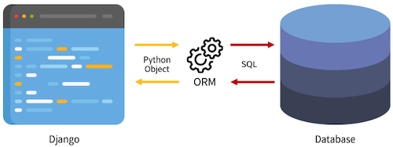
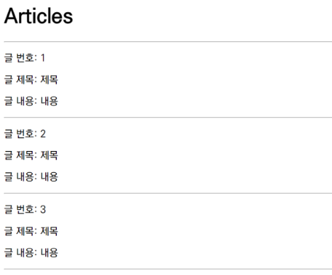
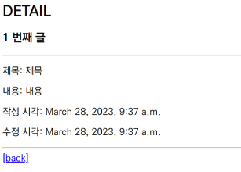
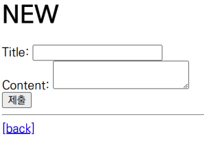

# Django ORM

Object Relational Mapping : OOP 를 사용하여 호환되지 않는 시스템 간에 데이터를 변환해주는 기술



## ORM Create

### QuerySet API

ORM 에서 데이터 검색, 필터링, 정렬 등 에 사용되는 도구

```bash
# ModelClass.Manager.QuerySetAPI

Article.objects.all()
```

QuerySet : Django ORM 을 통해 만들어진 자료형으로 데이터베이스에서 전달 받은 객체 목록

### QuerySet 등록

```bash
pip install ipython
pip install django-extensions
```

```python
# settings.py

INSTALLED_APPS = [
    'articles',
    'django_extensions',
    ...
]
```

Django shell : django 안에서 실행되는 python shell

### 데이터 객체 생성 방법

#### 첫번째

```bash
>>> article = Article()
>>> article
<Article: Article object (None)>

>>> article.title = 'first'
>>> article.content = 'django!'
>>> article.save()
>>> article
<Article: Article object (1)>

>>> article.title
'first'
```

#### 두번째

```bash
>>> article = Article(title='second', content='django~')
>>> article.save()

>>> article.pk
2
```

#### 세번째

```bash
>>> Article.objects.create(title='third', content='django')
<Article: Article object (3)>

# save 없이 바로 생성
```

## ORM Read

```bash
>>> Article.objects.all()
<QeurySet [<Article: Article object (1)>, <Article: Article object (2)>, <Article: Article object (3)>]>

>>> Article.objects.get(pk=1)
<Article: Article object (1)>

>>> Article.objects.filter(content='django~')
<QuerySet [<Article: Article object (2)>]>
```

## ORM Update

```bash
>>> article = Article.objects.get(pk=1)
>>> article.title = 'change'
>>> article.save()
>>> article.title
'change'
```

## ORM Delete

```bash
>>> article = Article.objects.get(pk=1)
>>> article.delete()
(1, {' articles.Article ' : 1})

>>> Article.objects.get(pk=1)
DoesNotExist: Article matching query does not exist.
```

## ORM Read with view

URL 파일 분리

```python
# project crud/urls.py

from django.contrib import admin
from django.urls import path, include

urlpatterns =[
    path('admin/', admin.site.urls),
    path('articles', include('articles.urls')),
]
```

```python
# articles/url.py

from django.urls import path
from . import views

app_name = 'articles'
urlpatterns =[
    path('', views.index, name='index'),
]
```

### 전체 게시글 조회

```python
# articles/views.py

from .models import Article

def index(request):
    articles = Article.objects.all()
    context = {
        'articles': articles,
    }
    return render(request, 'articles/index.html', context)
```

```html
<!-- articles/index.html -->

<h1>Articles</h1>
<hr>

  <p>글 번호: {{ article.pk }}</p>
  <p>글 제목: {{ article.title }}</p>
  <p>글 내용: {{ article.content }}</p>
  <hr>

```



### 단일 게시글 조회

```python
# articles/urls.py

urlpatterns =[
    path('', views.index, name='index'),
    path('<int:pk>/', views.detail, name='detail'),
]
```

```python
# articles/views.py

def detail(request, pk):
    article = Article.objects.get(pk=pk)
    context = {
        'article': article,
    }
    return render(request, 'articles/detail.html', context)
```

```html
<h2>DETAIL</h2>
<h3>{{ article.pk }} 번째 글 </h3>
<hr>
<p>제목: {{ article.title }}</p>
<p>내용: {{ article.content }}</p>
<p>작성 시각: {{ article.created_at }}</p>
<p>수정 시각: {{ article.updated_at }}</p>
<hr>
<a href="">[back]</a>
```



## ORM Create with view

```python
# articles/urls.py

urlpatterns =[
    path('', views.index, name='index'),
    path('<int:pk>/', views.detail, name='detail'),
    path('new/', views.new, name='new'),
    path('create/', views.create, name='create'),
]
```

```python
# articles/views.py

def new(request):
    return render(request, 'articles/new.html')


def create(request):
    title = request.GET.get('title')
    content = request.GET.get('content')
    
    article = Article(title=title, content=content)
    article.save()

    return render(request, 'articles/create.html')
```

```html
<!-- templates/articles/new.html -->

<h1>NEW</h1>
<form action="" method="GET">
  <div>
    <label for="title">Title: </label>
    <input type="text" name="title" id="title">
  </div>
  <div>
    <label for="content">Content: </label>
    <textarea name="content" id="content"></textarea>
  </div>
  <input type="submit">
</form>
<hr>
<a href="">[back]</a>
```



```html
<!-- templates/articles/create.html -->

<h1>게시글이 문제없이 작성 되었습니다.</h1>
```


## ORM Delete with view

```python
# articles/urls.py

urlpatterns =[
    path('', views.index, name='index'),
    path('<int:pk>/', views.detail, name='detail'),
    path('new/', views.new, name='new'),
    path('create/', views.create, name='create'),
    path('<int:pk>/delete/', views.delete, name='delete'),
]
```

```python
# articles/views.py

def delete(request, pk):
    article = Article.objects.get(pk=pk)
    article.delete()
    return redirect('articles:index')
```

```html
<!-- articles/detail.html -->

<h2>DETAIL</h2>
<form action="" method="POST">
  
  <input type="submit" value="DELETE">
</form>
<a href="">[back]</a>
```

## ORM Update with view

```python
# articles/urls.py

urlpatterns =[
    path('', views.index, name='index'),
    path('<int:pk>/', views.detail, name='detail'),
    path('new/', views.new, name='new'),
    path('create/', views.create, name='create'),
    path('<int:pk>/delete/', views.delete, name='delete'),
    path('<int:pk>/edit/', views.edit, name='edit'),
    path('<int:pk>/update/', views.update, name='update'),
]
```

```python
# articles/views.py

def edit(request, pk):
    article = Article.objects.get(pk=pk)
    context = {
        'article': article,
    }
    return render(request, 'articles/edit.html', context)


def update(request, pk):
    article = Article.objects.get(pk=pk)
    article.title = request.POST.get('title')
    article.content = request.POST.get('content')
    article.save()
    return redirect('articles:detail', article.pk)
```

```html
<!-- articles/detail.html -->

<h2>DETAIL</h2>
<a href="">EDIT</a><br>
<form action="" method="POST">
  
  <input type="submit" value="DELETE">
</form>
<a href="">[back]</a>
```

```html
<!-- articles/edit.html -->

<h1>EDIT</h1>
<form action="" method="POST">
  
  <div>
    <label for="title">Title: </label>
    <input type="text" name="title" id="title" value="{{ article.title }}">
  </div>
  <div>
    <label for="content">content: </label>
    <textarea name="content" id="content" value="{{ article.content }}"></textarea>
  </div>
  <input type="submit">
</form>
<hr>
<a href="">[back]</a>
```

### Render vs Redirect

render : template 호출

redirect : url 호출 (인자에 작성된 주소로 다시 요청을 보냄, context 못넘겨줌)

### GET vs Post

- get : 데이터를 url 뒤에 붙여서 보냄
  - ex) http://www.naver.com/index/?parameter=value
- post : 데이터를 body 에 넣어서 보냄
  - ex) body { "parameter":"value", ... }

### CSRF (Cross Site Request Forgery)

사이트 간 요청 위조

웹사이트 취약점 공격의 하나로, 사용자가 자신의 의지와는 무관하게 공격자가 의도한 행위를 특정 웹사이트에 요청하게 하는 공격

CSRF token : CSRF 방어 방법 중 하나

1. 서버가 사용자 입력 데이터에 token 부여
2. 매 요청마다 해당 token 을 포함시켜 전송
3. 서버에서 요청 받을 때마다 token 이 유효한지 검증

Django 에서 form 문 아래에  을 넣으면 사용 가능

## QuerySet reference

https://docs.djangoproject.com/en/3.2/ref/models/querysets/
