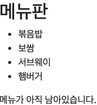
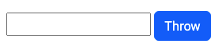

# Django Template System

데이터 표현을 제어하면서 표현과 관련된 로직 담당

## Django Template Language

Template 에서 조건, 반복, 변수, 필터 등의 프로그래밍적 기능 제공

- Variable : view 함수에서 render 함수의 3번째 인자로 딕셔너리 타입으로 넘겨 받을 수 있음
- Filters : 표시할 변수를 수정 가능
- Tags : 반복, 논리를 수행 (if, for)
- Comments : DTL 주석 처리

```html
{{ variable|filters }}


{# 주석 #}
```

```python
# urls.py

urlpatterns = [
    path('admin/', admin.site.urls),
    path('dinner/', views.dinner),
]
```

```python
# view.py

def dinner(request):
    foods = ['볶음밥', '보쌈', '서브웨이', '햄버거']
    context = {
        'foods' : foods
    }
    return render(request, 'articles/dinner.html', context)
```

```html
<!-- dinner.html -->

<!DOCTYPE html>
<html lang="en">
<head>
  <meta charset="UTF-8">
  <meta http-equiv="X-UA-Compatible" content="IE=edge">
  <meta name="viewport" content="width=device-width, initial-scale=1.0">
  <title>Document</title>
</head>
<body>
  
  <h2>메뉴판</h2>
  <ul>
    
    <li>{{food}}</li>
    
  </ul>
  
    <p>메뉴가 남아있지 않습니다.</p>
  
    <p>메뉴가 아직 남아있습니다.</p>
  
  
</body>
</html>
```



## Template Inheritance

페이지의 공툥요소를 포함하고 하위 template 이 재정의 할 수 있는 공간을 정의하는 기본 skeleton template 을 작성하여 상속 구조 구축

```html
<!-- base.html -->
<!-- bootstrap CDN 적용 -->
<!DOCTYPE html>
<html lang="en">
<head>
  <meta charset="UTF-8">
  <meta http-equiv="X-UA-Compatible" content="IE=edge">
  <meta name="viewport" content="width=device-width, initial-scale=1.0">
  <title>Document</title>
  <link href="https://cdn.jsdelivr.net/npm/bootstrap@5.3.0-alpha1/dist/css/bootstrap.min.css" rel="stylesheet" integrity="sha384-GLhlTQ8iRABdZLl6O3oVMWSktQOp6b7In1Zl3/Jr59b6EGGoI1aFkw7cmDA6j6gD" crossorigin="anonymous">
</head>
<body>
  
  
  <script src="https://cdn.jsdelivr.net/npm/bootstrap@5.3.0-alpha1/dist/js/bootstrap.bundle.min.js" integrity="sha384-w76AqPfDkMBDXo30jS1Sgez6pr3x5MlQ1ZAGC+nuZB+EYdgRZgiwxhTBTkF7CXvN" crossorigin="anonymous"></script>
</body>
</html>
```

```html
<!-- dinner.html -->



  <h2>메뉴판</h2>
  <ul>
    
    <li>{{food}}</li>
    
  </ul>
  
    <p>메뉴가 남아있지 않습니다.</p>
  
    <p>메뉴가 아직 남아있습니다.</p>
  

```

extends : 부모 template 을 상속받는 것을 의미

block : 자식 template 에서 재정의 할 수 있는 공간

## Request & Response

사용자의 입력 값을 활용하여 원하는 프로그래밍 작업을 진행

```python
# urls.py

urlpatterns = [
    path('admin/', admin.site.urls),
    path('dinner/', views.dinner),
    path('throw/', views.throw),
    path('catch/', views.catch),
]
```

```python
# views.py

def throw(request):
    return render(request, 'articles/throw.html')

def catch(request):
    content = request.GET.get('content')
    context = {
        'content': content,
    }
    return render(request, 'articles/catch.html', context)
```

```html
<!-- throw.html -->




  <form action="/catch/" method="GET">
    <div class="m-5">
      <input type="text" id="content" name="content">
      <button type="submit" class="btn btn-primary">Throw</button>
    </div>
  </form>

```



```html
<!-- catch.html -->




  <h1 class="m-5">{{ content }}</h1>

```


