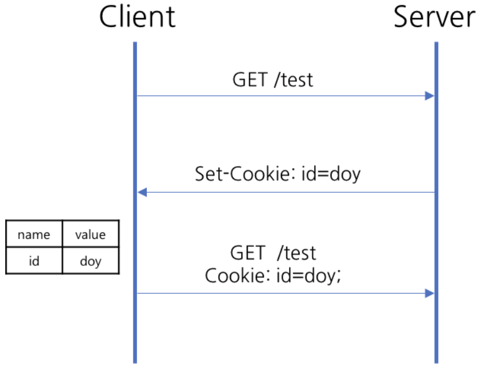

# Cookie

## Cookie 란

클라이언트가 웹사이트를 방문 할 때, 웹사이트의 서버를 통해 클라이언트의 브라우저에 설치되는 Key-Value 형태의 문자열 파일

## 동작 방식

1. 클라이언트가 서버로 접속 요청
2. 서버가 응답시 클라이언트에 저장하고 싶은 정보를 헤더 Set-Cookie 에 작성
3. 이후 클라이언트가 요청 할 때 마다 저장된 Cookie 를 헤더에 작성하여 요청

## 장단점

장점
- 웹 서버와 클라이언트 간의 상태 유지 (사용자의 세션 상태나 로그인 정보를 다음 페이지 요청 시에 유지 가능)
- 웹사이트 방문자의 행동을 추적하고 분석 가능
- 리소스를 클라이언트 측에 저장하고, 이를 통해 웹 페이지 로딩 속도 향상
- 영구적인 쿠키를 사용하여 사용자 설정, 언어 선택, 로그인 정보 등을 오랫동안 저장 가능

단점
- 클라이언트 측에 저장되므로 보안에 취약
- 브라우저마다 쿠키 크기에 제한이 있음
