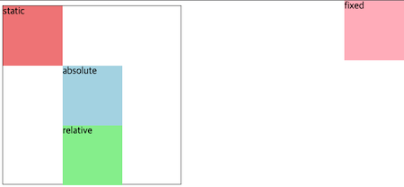

# Position

## Position 이란

Normal Flow 에서 요소를 끄집어내서 다른 위치에 배치하는 것

x, y, z 축 기준으로 이동

### static

- 기본값
- Normal Flow 에 따라 배치

### relative

- Normal Flow 에 따라 배치
- 자기 자신을 기준으로 이동

### absolute

- Normal Flow 에서 제거
- 가장 가까운 relative 부모 요소를 기준으로 이동

### fixed

- Normal Flow 에서 제거
- 현재 화면 영역을 기준으로 이동

### sticky

- Normal Flow 에 따라 배치
- 가장 가까운 block 부모 요소를 기준으로 이동
- 특정 임계점에 스크롤될 때 그 위치에서 고정
- 다음 sticky 요소는 이전 sticky 의 자리를 대체 (겹쳐집)

```html
<!DOCTYPE html>
<html lang="en">
<head>
    <meta charset="UTF-8">
    <meta http-equiv="X-UA-Compatible" content="IE=edge">
    <meta name="viewport" content="width=device-width, initial-scale=1.0">
    <title>Document</title>
    <style>
        * {
            box-sizing: border-box;
        }
        .container {
            position: relative;
            width: 300px;
            height: 300px;
            border: 1px solid black;
        }
        .box {
            width: 100px;
            height: 100px;
        }
        .static {
            position: static;
            background-color: lightcoral;
        }
        .absolute {
            position: absolute;
            background-color: lightblue;
            top: 100px;
            left: 100px;
        }
        .relative {
            position: relative;
            background-color: lightgreen;
            top: 100px;
            left: 100px;
        }
        .fixed {
            position: fixed;
            background-color: lightpink;
            top: 0;
            right: 0;
        }
    </style>
</head>
<body>
    <div class="container">
        <div class="box static">static</div>
        <div class="box absolute">absolute</div>
        <div class="box relative">relative</div>
        <div class="box fixed">fixed</div>
    </div>
</body>
</html>
```



## z-index

요소가 겹쳐졌을 때 어떤 요소가 위에 놓이게 할지 결정
