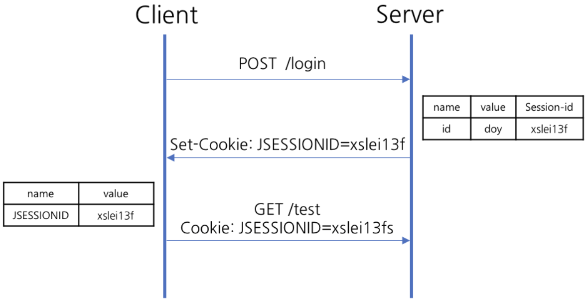

# Session

## Session 이란

클라이언트가 웹사이트를 방문 할 때, 웹사이트의 서버에 설치되는 Key-Value 형태의 문자열 파일

## 동작 방식

1. 클라이언트가 서버로 접속 요청
2. 서버가 클라이언트에 Session ID 를 부여
3. 서버가 응답할 때 HTTP 헤더(Set-Cookie)에 Session ID를 포함해서 전송
4. 클라이언트는 이후 웹브라우저를 닫기전까지 다음 요청 때 부여된 Session ID 가 담겨있는 쿠키를 HTTP 헤더에 넣어서 전송
5. 서버는 세션 ID 및 해당 세션에 관련된 정보를 확인한 후 응답

## 장단점

장점
- 서버 측에 저장되고 관리되기 때문에 쿠키보다 보안적으로 안전
- 다양한 데이터를 저장 가능
- 클라이언트가 웹 브라우저를 닫거나 일정 시간 동안 활동하지 않을 때 자동으로 종료
- 사용자가 여러 탭이나 창을 통해 웹 애플리케이션을 사용할 때에도 상태를 일관되게 유지

단점
- 세션 데이터는 서버 측에서 관리되므로, 많은 사용자가 동시에 접속할 경우 서버 부하가 발생
- 사용자가 많아지는 경우 로드 밸런싱을 통한 서버 확장을 이용해야 하는 데 이 때 세션의 관리가 어려움
