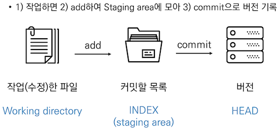

# git
분산형 버전 관리 시스템(DVCS) 으로 코드의 버전을 관리하는 도구이다.
<br>
<br>

## 흐름


git 은 파일을 modified, staged, committed 로 관리
- modified : 파일이 수정된 상태
- staged : 수정할 파일을 커밋할 것이라고 표시한 상태
- committed : 커밋 된 상태
<br>
<br>

## 장점
- 오프라인 작업이 가능하다. TFS 등의 기존 중앙집중형 형상관리 툴은 오프라인 작업을 아예 지원하지 않거나, 매우 제한적으로만 지원하였다. 본인이 특정 파일을 체크아웃했다는 사실이 실시간으로 서버에 드러나야 하기 때문이다. 온라인 상태에서 체크아웃한 파일은 오프라인 상태에서도 계속 작업할 수 있는 경우도 있으나, 이 경우에는 추가적인 형상관리가 안된다. git는 저장소를 일단 로컬에 복제하고, 로컬 저장소에 있는 히스토리도 그대로 유지되므로, 서버에서 새 자료를 받아올 수 없을 뿐이지 이외에는 오프라인 상태에서도 대부분의 형상관리 기능을 이용할 수 있다. 일종의 로컬 서버로 작용하는 셈.
- 속도가 빠르다. 각각의 개발자들이 모두 분산처리 서버의 주인이 되는 셈이므로 서버가 직접 해야 될 일들이 많이 줄어든다.
- 일시적인 서버 장애가 있어도 개발을 계속할 수 있다. 로컬 저장소를 이용하면 되기 때문.
- 서버와 클라이언트 뿐인 기존 형상관리에 비해 분산처리 구조를 유연하게 세울 수 있다. 중간 서버를 둔다든지, 부서별로 따로 서버를 둔다든지 하는 구성이 자유롭게 가능.
- 가지치기(branch)가 비교적 가볍다. 가지치기 자체를 git의 장점으로 꼽기도 하지만 이는 현존하는 대부분의 형상관리 도구가 지원하는 기능이다. 실질적인 차이는 그 구현 방법에 있다고 봐야 한다. git는 브랜칭이 매우 쉽고 가벼워 원하는 만큼 별 제약 없이 생성하고 삭제할 수가 있다. git만 사용해오던 사람은 당연하게 느껴질 것이고 이게 왜 장점인지조차 모를 수 있겠지만, 기존 형상관리 도구를 사용하던 사람들은 브랜칭 하나 하려고 수 시간의 미팅을 해야 하던 때도 있었다.
- 병합(merge)에서 문제가 덜 발생한다. 서버의 자료를 가져와(fetch) 로컬에서 병합하고 이를 다시 올리는 형태이기 때문. 물론 아예 문제가 발생하지 않을 수는 없으나, 이러한 구조 덕분에 예기치 못하게 발생하는 병합 문제 발생 빈도가 낮아진다.
- 스테이징을 지원한다. 단순히 커밋되지 않은 로컬 변동사항을 얘기하는 것이 아니고, 아예 커밋하기 전에 사용해야 하는 스테이징 단계가 따로 있다. 물론 이를 사용하지 않고 다른 형상관리 도구처럼 바로 커밋하는 식으로 사용할 수도 있다.
- 직접 호스팅을 할 경우 상업용 용도로도 무료로 이용 가능한 방법이 존재한다.
- 수많은 개발자용 툴이 Git을 자체 지원하거나, Git용 플러그인이 있다. 또한 관련 툴킷 범위도 넓어, 초보자를 위한 GUI부터 전문자용 Diff툴까지 Git사용에 도움이 되는 툴이 많다. 또한 libgit2 등을 이용하면 원하는 언어로 Git을 활용하는 프로그램을 직접 만들 수도 있다.
<br>
<br>

## 단점
- 기존 형상관리 도구에 비해 덜 직관적이고 배우기 어렵다. 특히 중앙 집중형 형상관리 도구에 익숙한 사람일수록 귀찮고 어려워지는데, 용어도 컨셉트도 처리과정도 전혀 다르기 때문. 로컬 머신을 작업공간, 서버를 저장공간으로 생각하면 더 이상 복잡한 개념이 필요 없이 체크아웃 후 파일을 수정하고 다시 커밋하기만 하면 되는 중앙집중형 도구에 비해 git는 설계적으로 작업 디렉토리 - 스테이징 공간 - 로컬 저장소 - 원격 저장소 라는 다층구조를 가지고 있으며, 각각의 맡은 역할과 다른 계층과의 상호작용 방식이 단순 반복이 아니라 훨씬 복잡하게 연결된다. 게다가 이들 각각이 모두 실제 파일이 있는 공간을 의미하는 것이 아니라 작업 내용이 관리되는 개념적인 가상 공간과 실제 물리적 저장소가 섞여 있어 혼동을 유발한다.
- 커밋, 푸시, 풀, 머지, 페치 등 영어 단어상으로는 비슷비슷하지만 구체적인 역할과 의미에 차이가 있는 수많은 용어들이 존재하며 기존의 지식이 이 새로운 컨셉트를 이용하는 데에 크게 방해가 된다. 또한 처음 배우는 경우 어디까지가 서버에 영향을 미치는 행위이고 어디까지가 로컬에서 안전하게 할 수 있는 일인지 명확하게 이해하기가 어려워 명령어 하나하나에 벌벌 떨게 된다. 서버에 있는 자료와 로컬의 자료를 비교하여 커밋 후에 무슨 변화가 일어나는지 미리 명확하게 알 수 있는 기존 형상관리에 비하면 확실히 덜 직관적이다. 바로 이 문제 때문에 기존 형상관리 도구를 계속 사용하는 경우도 많다.
- 이 때문에 git을 사용하는 유형은 '확실하게 파악한 기능의 커맨드 조합을 안전하게 계속 반복하며 작업하는' 콘솔 명령어 파와, GUI 프로그램에서 규격화하여 제공하는 기능을 맡기고 사용하는 서드파티 프로그램 파로 크게 나뉜다. 둘 모두 결국에는 자신이 충분히 믿을 수 있을 정도로 동작을 파악한 후, 그 기능을 반복적으로 사용하는 경우가 많다.
- 작업 계층 구조(작업 내용 - 스테이징 공간 - 로컬 저장소 - 원격 저장소 등)에 대한 '기능' 은 매우 명확하게 만들어져 있고 그 동작도 일정하지만, 정작 이를 해석해서 추상화하는 사람들의 해석과 설명이 제각각인 경우가 많다. 단적으로 구글에 'Git Workflow'만 검색해 봐도, '알기 쉬운 도표' 들이 수없이 검색되지만 완전히 똑같이 생긴 것이 없다시피 할 정도다. 앞에 언급한 작업 계층 구조의 명칭-역할의 조합에 미묘한 차이가 있는 것은 물론이고, 아예 특정 단계가 없어 단계의 숫자가 다르고, 도표에서 화살표로 표시된 각 명령어가 어느 단계에서 어느 단계로 오가는 작업인지조차 잘 뜯어보면 조금씩 다 다르다. 이는 git의 명령어가 명시적으로 특정 단계와 특정 단계가 연결된다고 딱 잘라 말할 수 없고, 그것을 단순히 화살표 하나로 표시할 수 없는 미묘한(그러나 나름 의미가 있는) 동작을 하기 때문이다. 이 때문에 'git에 익숙해진 사용자' 는 스스로 각 명령어에 대해 체감적으로 이해하고 있고 손에 익어 사용하고 있다고 느끼지만, 정작 그것을 표현하려고 보면 각 사용자끼리 표현방식이 일치하지 않는 복잡미묘한 개개인 직관의 문화가 정착되어 있다.
- 한 번에 여러 브랜치나 여러 태그에 걸쳐서 커밋을 할 수 없다. 내가 만든 사소한 변동사항이 다른 브랜치에 자동적으로 알려지지 않고, 나중에 취합하는 시점이 돼서야 반영된다. 때에 따라선 이후 다른 브랜치와 병합하려 할 때 충돌의 원인이 될 수도 있다.
- 하나의 저장소가 하나의 프로젝트 전체를 의미하는 것으로 강제되어 있어 일부만 브랜칭을 한다든지 클론을 한다든지 하는 일을 할 수 없다. 정책적인 부분이라 관점에 따라 장점이 될 수도 있겠지만, 해당 기능이 꼭 필요한 사람이라면 단점이 될 수 있다.
- push를 했다 해서 커밋 히스토리가 영원히 안전하게 저장된다고 장담할 수 없다. 중앙 집중형 형상관리에서는 일단 체크인을 하고 나면 서버에 문제가 생기지 않는 한에는 항상 안전하고 언제든 과거 기록을 볼 수 있으나, git에서는 push를 한 내용이라 하더라도 해당 브랜치가 다른 브랜치에 병합되기 전에 삭제돼버리면 나중에 해당 내용에 접근할 수 없다.
- 커밋 ID가 긴 16진수 숫자(SHA-1 해시값)라 기억하기가 어렵고 항상 복사-붙여넣기를 해야 한다. 단순한 10진수 숫자로만 구성되어 있는 TFS 등에 비해 복잡한 것은 사실이다.
- 서버에 저장소를 두고 로컬 머신에서는 작업중인 프로젝트만을 두는 것이 설계개념상 불가능하다. 원격 저장소와 로컬 저장소를 모두 요구하기 때문에 저장소 전체를 받아서 작업해야 된다는 부분도 원하지 않는 경우 단점이다. 작업 패턴이 git에 맞추어져 있다면 로컬 저장소 작업 공간 자체를 '원래 없었던 용량' 으로 생각하고 branch 등으로 늘어나는 체감 용량이 작다고 생각할 수 있지만, 당연하게도 저장소 용량은 작업이 무엇이냐에 따라 무한정 커질 수 있으며, 이 공간이 로컬 저장소와 서버에 1:1 비율로 동시에 요구되게 된다. 기존 형상관리 툴이 원하는 파일 하나만 덜렁 받아서 작업하고 체크인할 수도 있는 것에 비하면 구조적으로 로컬과 원격, 총 2배수 공간을 사용하도록 설계되어 있다.
<br>
<br>

## 명령어
```
- git init : 로컬 저장소 생성
- git add <파일명> : 특정 파일 / 폴더의 변경사항 추가
- git commit -m '<커밋메시지>' : 커밋 (버전 기록)
- git status : 상태 확인
  - tracked : 이전부터 버전으로 관리되고 있는 파일
    - unmodified : git status 에 나타나지 않음
    - modified : changes not staged for commit
    - staged : changed to be committed
  - untracked : 버전으로 관리된 적 없는 파일 (새로운 파일)
- git log : 버전 확인
- git push <원격저장소> <브랜치> : 원격저장소에 push (upload)
- git pull <원격저장소> <브랜치> : 원격저장소로부터 pull (download)
- git clone <url> : 원격저장소 복제
- git remote -v : 원격저장소 정보 확인
- git remote add <원격저장소> <url> : 원격저장소 추가
- git remote rm <원격저장소> : 원격저장소 삭제
```
<br>
<br>

## .gitignore
프로젝트에서 버전 관리가 필요하지 않은 파일, 폴더 등을 관리할 수 있는 파일
<br>
이미 commit 된 파일은 gitignore 에 넣어도 ignore 가 안되기에 프로젝트 시작 전에 설정 (commit 된 파일 삭제하면 ignore 적용 가능)
<br>
ex) 비밀번호, 고객정보 등
<br>
https://github.com/github/gitignore
<br>
https://www.toptal.com/developers/gitignore
<br>
에서 template 참고 가능
<br>
<br>

## 참고하기 좋은 블로그
- https://backlog.com/git-tutorial/kr/intro/intro1_1.html
- https://git-scm.com/book/ko/v2/%EC%8B%9C%EC%9E%91%ED%95%98%EA%B8%B0-%EB%B2%84%EC%A0%84-%EA%B4%80%EB%A6%AC%EB%9E%80%3F
<br>
<br>
