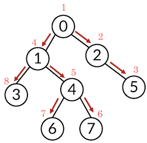

# DFS (Depth First Search)

## DFS 란

깊이 우선 탐색으로 한 노드의 자식을 끝까지 탐색 후 다시 돌아와 다른 형제의 자식을 탐색하는 알고리즘

이미 방문한 노드와 앞으로 탐색 할 노드를 기준으로 구현

일반적으로 스택 알고리즘을 사용하기에 후입선출

인접한 노드가 여러 개라면 한 개씩 넣음

탐색 방향은 왼쪽 -> 오른쪽 또는 오른쪽 -> 왼쪽 둘 다 가능 하지만 후입선출 기준은 오른쪽 -> 왼쪽



### 리스트로 구현

오른쪽 -> 왼쪽 방향 탐색

```python
def dfs(start):
    stack = [start]
    visited[start] = 1
    while stack:
        cur = stack.pop()
        print(cur)
        for adj in graph[cur]:
            if not visited[adj]:
                visited[adj] = 1
                stack.append(adj)
    return visited

n = 8
visited = [0] * n
graph = [
    [1, 2],
    [0, 3, 4],
    [0, 5],
    [1],
    [1, 6, 7],
    [2],
    [4],
    [4]
]

print(dfs(0))

>>> 0    # 탐색 순서
    2
    5
    1
    4
    7
    6
    3
    [1, 1, 1, 1, 1, 1, 1, 1]    # 탐색한 노드 == 1
```

### 재귀함수로 구현

왼쪽 -> 오른쪽 방향 탐색

```python
def dfs(start):
    visited.append(start)
    for node in graph[start]:
        if node not in visited:
            dfs(node)
    return visited

n = 8
visited = []
graph = [
    [1, 2],
    [0, 3, 4],
    [0, 5],
    [1],
    [1, 6, 7],
    [2],
    [4],
    [4]
]

print(dfs(0))

>>> [0, 1, 3, 4, 6, 7, 2, 5]    # 탐색 순서
```

### deque 로 구현

오른쪽 -> 왼쪽 방향 탐색

```python
from collections import deque

def dfs(start):
    visited = []
    stack = deque()
    stack.append(start)
    while stack:
        node = stack.pop()
        if node not in visited:
            visited.append(node)
            stack.extend(graph[node])
    return visited

n = 8
graph = [
    [1, 2],
    [0, 3, 4],
    [0, 5],
    [1],
    [1, 6, 7],
    [2],
    [4],
    [4]
]

print(dfs(0))

>>> [0, 2, 5, 1, 4, 7, 6, 3]    # 탐색 순서
```
