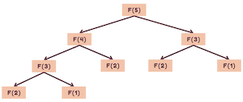

# DP (Dynamic Programming)

## DP 란

복잡한 문제를 간단한 여러 개의 문제로 나누어 푸는 방법

부분 문제 반복 (겹치는 부분 문제) 과 최적 부분 구조를 가지고 있는 알고리즘을 일반적인 방법에 비해 더욱 적은 시간 내에 풀 때 사용

피보나치 수열을 일반적인 재귀함수로 코딩하면 아래와 같다

```python
def fibonacci(n):
    if n == 1 or n == 2:
        return 1
    return fibonacci(n-1) + fibonacci(n-2)
```



똑같은 함수 (ex: F(3), F(2) 등) 를 여러번 호출하기에 비효율적

## Memoization

DP 구현 방식 중 하나로 Top-Down 방식 (하향식)

```python
dp = [0]*20
dp[0] = 1 
dp[1] = 1

def fibonacci(n):
    if dp[n] == 0:
        dp[n] = fibonacci(n-1) + fibonacci(n-2)
    return dp[n]

fibonacci(10)
print(dp)

>>> [1, 1, 2, 3, 5, 8, 13, 21, 34, 55, 89, 0, 0, 0, 0, 0, 0, 0, 0, 0]
```

## Tabulation

DP 구현 방식 중 하나로 Down-Up 방식 (상향식)

```python
dp = [0]*(20)
dp[0] = 1
dp[1] = 1

def fibonacci(n):
    for i in range(2,n+1):
        dp[i] = dp[i-1] + dp[i-2]
    return dp[n]

fibonacci(10)
print(dp)

>>> [1, 1, 2, 3, 5, 8, 13, 21, 34, 55, 89, 0, 0, 0, 0, 0, 0, 0, 0, 0]
```
