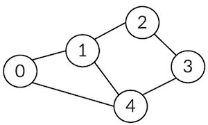
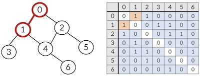

# 그래프

## 그래프 란

자료구조에서 그래프는 연결되어 있는 객체 간의 관계를 표현한 비선형 자료구조를 의미

- 정점 (vertex) : 여러 가지 특성을 가질 수 있는 객체, 노드 (node) 라고도 함


- 간선 (edge) : 정점 간의 관계를 표현하는 선


- 경로 (path) : 시작 정점부터 종료 정점까지의 정점을 나열한 것


- 인접 (adjacency) : 두 개의 정점이 하나의 간선으로 연결된 상태


## 종류

### 무방향 그래프

간선의 방향이 없는 그래프로 양방향으로 정점 이동 가능

- 차수 (degree) : 하나의 정점에 연결된 간선의 갯수

모든 정점의 차수 합 : 간선 수 x 2



### 유방향 그래프

간선의 방향이 있는 그래프로 가리키는 방향으로만 이동 가능

- 진입 차수 : 다른 정점에서 현재 정점으로 들어오는 간선의 수
- 전출 차수 : 현재 정점에서 다른 정점으로 나가는 간선의 수


## 그래프 표현

인접 행렬 vs 인접 리스트

인접 행렬은 만들기 쉽고 직관적이지만 불필요한 공간 낭비

인접 리스트는 연결된 정점만 표현하여 효율적

### 인접 행렬

두 정점을 연결하는 간선이 있으면 1, 없으면 0 을 행렬로 표현



```python
data_input = [
    (0, 1), (0, 2), (1, 3), (1, 4), (2, 4), (2, 5), (4, 6)
]
vertex = 7
edge = 7
graph = [[0]*vertex for _ in range(vertex)]
for x, y in data_input:
    graph[x][y], graph[y][x] = 1, 1
print(graph)

>>> [
    [0, 1, 1, 0, 0, 0, 0],
    [1, 0, 0, 1, 1, 0, 0],
    [1, 0, 0, 0, 1, 1, 0],
    [0, 1, 0, 0, 0, 0, 0],
    [0, 1, 1, 0, 0, 0, 1],
    [0, 0, 1, 0, 0, 0, 0],
    [0, 0, 0, 0, 1, 0, 0]
    ]
```

### 인접 리스트

각 정점에 인접 정점들을 순차적 리스트로 표현


```python
data_input = [
    (0, 1), (0, 2), (1, 3), (1, 4), (2, 4), (2, 5), (4, 6)
]
vertex = 7
edge = 7
graph = [[] for _ in range(vertex)]
for x, y in data_input:
    graph[x].append(y)
    graph[y].append(x)
print(graph)

>>> [
    [1, 2],
    [0, 3, 4],
    [0, 4, 5],
    [1],
    [1, 2, 6],
    [2],
    [4]
    ]
    # 인덱스 번호가 정점의 번호
```

