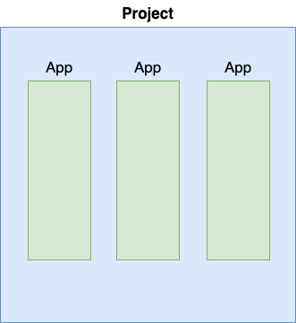
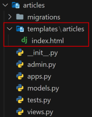

# django

Django (장고) : 보안이 우수하고 유지보수가 편리한 웹사이트를 신속하게 개발하는 하도록 도움을 주는 파이썬 웹 프레임워크

프레임워크 : 어떠한 목적을 달성하기 위해 복잡하게 얽혀있는 문제를 해결하기 위한 구조며, 소프트웨어 개발에 있어 하나의 뼈대 역할

## 디자인 패턴

MTV (Model - Template - View) : Django 의 디자인 패턴

- Model : DB 에 저장되는 데이터<br>
models.py 에서 처리

- Template : 사용자들에게 보여지는 화면<br>
templates 폴더의 html 파일에서 처리

- View : 데이터 처리 및 가공<br>
view.py 에서 처리

- URLconf : 처리 및 가공한 데이터를 사용자들이 보는 화면으로 넘김 (url 과 view 를 매핑시킴)<br>
urls.py 에서 처리


## Django 설치

### 가상환경 생성

python -m venv 가상환경이름

```bash
python -m venv venv
# venv 란 가상환경 생성
```

### 가상환경 활성화

```bash
source venv/Scripts/activate
# Window

source venv/bin/activate
# mac
```

### 설치

```bash
pip install django
# django 최신 버전 설치

pip install django==3.2.18
# django 3.2.18 버전 설치
```

### requirements.txt

패키지 관리 파일로 대부분 파일 이름은 requirements.txt 로 생성

생성

```bash
pip freeze > requirements.txt
```

```
asgiref==3.6.0
Django==3.2.18
pytz==2022.7.1
sqlparse==0.4.3
```

```
== 1.2: 정확히 1.2 버전
>= 1.2: 1.2 버전 이상
>= 1.* : 1 버전대 아무 버전
<= 1.2 : 1.2 버전 이하
!= 1.2 : 1.2 버전 외 아무 버전
```

설치

```bash
pip install -r requirements.txt
```

## Django Project 생성

django-admin startproject 프로젝트이름

```bash
django-admin startproject pjt .
# 현재 폴더에 pjt 프로젝트 (폴더) 생성 - 추천

django-admin startproject pjt
# 현재 폴더/pjt 폴더에 pjt 프로젝트 (폴더) 생성
```

## Django 서버 실행

```bash
python manage.py runserver
```

http://127.0.0.1:8000/ 접속하여 아래 이미지가 뜨면 서버 실행 성공


## .gitignore

Git repository 등 에 추가되면 안되는 폴더나 파일을 정의하여 추가되지 않게 관리

이미 git add, commit 된 경우 적용되지 않기에 주의

Git root 디렉토리에 .gitignore 파일 생성

- [폴더]/ : 폴더 내에 모든 파일 무시
- [파일] : 특정 파일 무시
- [폴더]/[파일] : 특정 폴더에서 특정 파일 무시
- *.[확장자] : 특정 확장자 모두 무시

https://www.toptal.com/developers/gitignore/ 같은 사이트에서 자주 사용하는 환경의 코드 생성 가능

## Django App



Django Project : App 의 집합

Django App : 독립적으로 작동하는 기능 단위의 모듈

### App 생성

python manage.py startapp 앱이름

```bash
python manage.py startapp articles
```

### App 등록

반드시 App 생성 후 등록

```python
# Project - settings.py

INSTALLED_APPS = [
    'articles',
    'django.contrib.admin',
    'django.contrib.auth',
    'django.contrib.contenttypes',
    'django.contrib.sessions',
    'django.contrib.messages',
    'django.contrib.staticfiles',
]
```

## 구조

### Project 구조


- \_\_init\_\_.py : 해당 폴더를 패키지로 인식하도록 설정
- asgi.py : 비동기식 웹 서버와의 연결 관련 설정
- wsgi.py : 웹 서버와의 연결 관련 설정
- manage.py : Django 와 다양한 방법으로 상호작용하는 커맨드라인 유틸리티

### App 구조


- admin.py : 관리자용 페이지 설정
- models.py : DB 와 관련된 Model 정의 (MTV 의 M)
- views.py : HTTP 요청 처리 및 응답 반환 (MTV 의 V)
- apps.py : app 정보가 작성되는 곳
- tests.py : 테스트 코드 작성하는 곳

## 요청 및 응답

### URL

```python
# Proejct - urls.py

from django.contrib import admin
from django.urls import path
from articles import views

urlpatterns = [
    path('admin/', admin.site.urls),
    path('articles/', views.index),
]
```

http://127.0.0.1/articles/ 로 요청이 오면 views 모듈의 index 함수를 호출

### View

```python
# App - views.py

from django.shortcuts import render

def index(request):
    return render(request, 'articles/index.html')
```

index 함수가 호출되면 articles 폴더에 있는 index.html 을 렌더링

### Templates

Django 에서 app / templates 폴더까지 기본 경로로 인식하기에 views.py 에서 'articles/index.html' 로 작성


