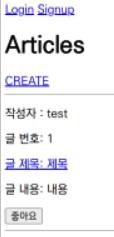

# Django Many to Many Relationship

하나의 테이블에서 0개 이상의 레코드가 다른 테이블의 레코드 0개 이상과 관련된 관계

N:M or M:N

article(M) - user(N) : 0개의 게시글은 0명 이상의 회원과 관련

## 좋아요 구현

```python
# articles/models.py

class Article(models.Model):
    user = models.ForeignKey(settings.AUTH_USER_MODEL, on_delete=models.CASCADE)
    like_users = models.ManyToManyField(settings.AUTH_USER_MODEL, related_name='like_articles')
    title = models.CharField(max_length=10)
    content = models.TextField()
    created_at = models.DateTimeField(auto_now_add=True)
    updated_at = models.DateTimeField(auto_now=True)
```

```cmd
python manage.py makemigrations
python manage.py migrate
```

```python
# articles/urls.py

urlpatterns = [
    ...
    path('<int:article_pk>/likes/', views.likes, name='likes'),
]
```

```python
# articles/views.py

@login_required
def likes(request, article_pk):
    article = Article.objects.get(pk=article_pk)
    if article.like_users.filter(pk=request.user.pk).exists():
        article.like_users.remove(request.user)
    else:
        article.like_users.add(request.user)
    return redirect('article:index')
```

```html
<!-- article/index.html -->


  ...
  <form action="" method="POST">
    
    
      <input type="submit" value="좋아요 취소">
    
      <input type="submit" value="좋아요">
    
  </form>
  <hr>

```


