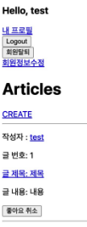
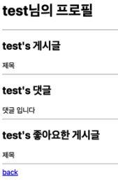
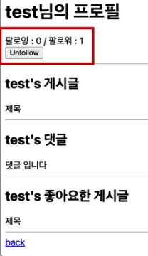

# Django Many to Many Relationship

하나의 테이블에서 0개 이상의 레코드가 다른 테이블의 레코드 0개 이상과 관련된 관계

N:M or M:N

article(M) - user(N) : 0개의 게시글은 0명 이상의 회원과 관련

## 좋아요 구현

```python
# articles/models.py

class Article(models.Model):
    user = models.ForeignKey(settings.AUTH_USER_MODEL, on_delete=models.CASCADE)
    like_users = models.ManyToManyField(settings.AUTH_USER_MODEL, related_name='like_articles')
    title = models.CharField(max_length=10)
    content = models.TextField()
    created_at = models.DateTimeField(auto_now_add=True)
    updated_at = models.DateTimeField(auto_now=True)
```

```cmd
python manage.py makemigrations
python manage.py migrate
```

```python
# articles/urls.py

urlpatterns = [
    ...
    path('<int:article_pk>/likes/', views.likes, name='likes'),
]
```

```python
# articles/views.py

@login_required
def likes(request, article_pk):
    article = Article.objects.get(pk=article_pk)
    if article.like_users.filter(pk=request.user.pk).exists():
        article.like_users.remove(request.user)
    else:
        article.like_users.add(request.user)
    return redirect('article:index')
```

```html
<!-- article/index.html -->


  ...
  <form action="" method="POST">
    
    
      <input type="submit" value="좋아요 취소">
    
      <input type="submit" value="좋아요">
    
  </form>
  <hr>

```


## Profile 구현

```python
# accounts/urls.py

urlpatterns = [
    ...
    path('profile/<username>/', views.profile, name='profile'),
]
```

```python
# accounts/views.py

def profile(request, username):
    User = get_user_model()
    person = User.objects.get(username=username)
    context = {
      'person': person,
    }
    return render(request, 'accounts/profile.html', context)
```

```html
<!-- accounts/profile.html -->

<h1>{{ person.username }}님의 프로필</h1>
<hr>
<h2>{{ person.username }}'s 게시글</h2>

  <div>{{ article.title }}</div>

<hr>
<h2>{{ person.username }}'s 댓글</h2>

  <div>{{ commtent.content }}</div>

<hr>
<h2>{{ person.username }}'s 좋아요한 게시글</h2>

  <div>{{ article.title }}</div>

```

```html
<!-- articles/index.html -->

<a href="">내 프로필</a>

<p>작성자 : <a href="">{{ article.user }}</a></p>
```





## Follow 구현

```python
# accounts/models.py

class User(AbstractUser):
    followings = models.ManyToManyField('self', symmetrical=False, related_name='follwers')
```

```cmd
python manage.py makemigrations
python manage.py migrate
```

```python
# accounts/urls.py

urlpatterns = [
    ...
    path('<int:user_pk>/follow/', views.follow, name='follow'),
]
```

```python
# accounts/views.py

@login_required
def follow(request, user_pk):
    User = get_user_model()
    person = User.objects.get(pk=user_pk)
    if person != request.user:
        if person.followers.filter(pk=request.user.pk).exists():
            person.followers.remove(request.user)
        else:
            person.followers.add(request.user)
    return redirect('accounts:profile', person.username)
```

```html
<!-- accounts/profile.html -->

<div>
  <div>
    팔로잉 : {{ person.followings.all|length }} / 팔로워 : {{ person.followers.all|length }}
  </div>
  
    <div>
      <form action="" method="POST">
        
        
          <input type="submit" value="Unfollow">
        
          <input type="submit" value="Follow">
        
      </form>
    </div>
  
</div>
```


