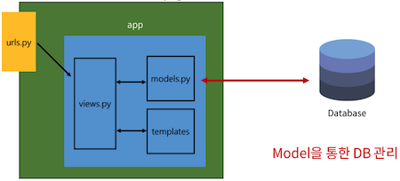
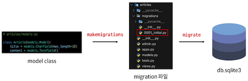
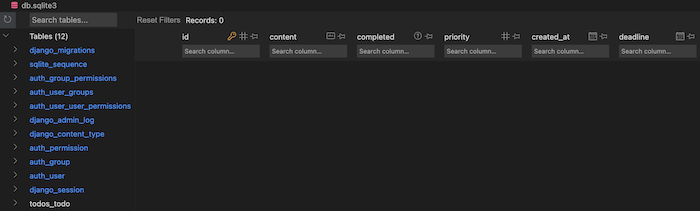
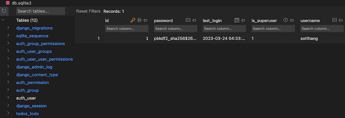
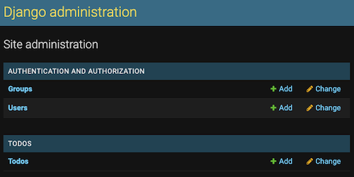
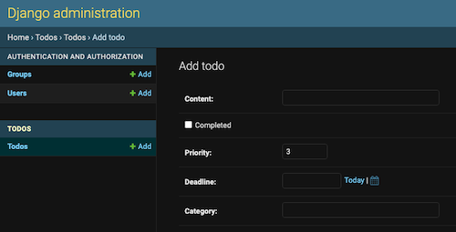

# Django Model

DB 의 테이블 정의, 데이터 조작 등 을 할 수 있는 기능 제공

django 의 기본 DB 는 SQLite



## Model 작성

```python
# app/models.py

class Todo(models.Model):
    content = models.CharField(max_length=80)
    completed = models.BooleanField(default=False)
    priority = models.IntegerField(default=3)
    created_at = models.DateField(auto_now_add=True)
    deadline = models.DateField(null=True)
```

## Migrations

Model 클래스에서 정의한 내용을 DB 에 반영

Migrations Flow



```bash
# Model 클래스를 설계도 (migration) 로 작성
python manage.py makemigrations

# 만들어진 설계도를 DB 에 반영
python manage.py migrate
```

Migrate 후 DB 에 테이블 생성 확인



## Model 수정

```python
# app/models.py

class Todo(models.Model):
    content = models.CharField(max_length=80)
    completed = models.BooleanField(default=False)
    priority = models.IntegerField(default=3)
    created_at = models.DateField(auto_now_add=True)
    deadline = models.DateField(null=True)
    category = models.CharField(max_length=20) # 필드 추가
```

```
python manage.py makemigrations

You are trying to add a non-nullable field 'category' to todo without a default; we can't do that (the database needs something to populate existing rows).
Please select a fix:
 1) Provide a one-off default now (will be set on all existing rows with a null value for this column)
 2) Quit, and let me add a default in models.py
Select an option: 1
Please enter the default value now, as valid Python
The datetime and django.utils.timezone modules are available, so you can do e.g. timezone.now
Type 'exit' to exit this prompt
>>> timezone.now

python manage.py migrate
```

## Admin Site

### Automatic Admin Interface

Django 는 추가 설치, 설정 없이 관리자 인터페이스 제공

### Admin 계정 생성

```bash
python manage.py createsuperuser

# email 은 선택사항
# password 타이핑시 보안으로 인해 터미널에서 보이지 않음
```

DB 에서 admin 계정 생성 확인



admin 에 model class 등록

```python
# app/admin.py

from django.contrib import admin
from .models import Todo

# Register your models here.

admin.site.register(Todo)
```

생성한 admin 계정으로 http://127.0.0.1:8000/admin/ 로그인 후 모델 클래스 및 테이블 확인




