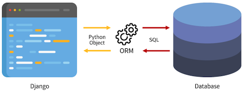

# Django ORM

Object Relational Mapping : OOP 를 사용하여 호환되지 않는 시스템 간에 데이터를 변환해주는 기술



## ORM Create

### QuerySet API

ORM 에서 데이터 검색, 필터링, 정렬 등 에 사용되는 도구

```bash
# ModelClass.Manager.QuerySetAPI

Article.objects.all()
```

QuerySet : Django ORM 을 통해 만들어진 자료형으로 데이터베이스에서 전달 받은 객체 목록

### QuerySet 등록

```bash
pip install ipython
pip install django-extensions
```

```python
# settings.py

INSTALLED_APPS = [
    'articles',
    'django_extensions',
    ...
]
```

Django shell : django 안에서 실행되는 python shell

### 데이터 객체 생성 방법

#### 첫번째

```bash
>>> article = Article()
>>> article
<Article: Article object (None)>

>>> article.title = 'first'
>>> article.content = 'django!'
>>> article.save()
>>> article
<Article: Article object (1)>

>>> article.title
'first'
```

#### 두번쨰

```bash
>>> article = Article(title='second', content='django~')
>>> article.save()

>>> article.pk
2
```

#### 세번째

```bash
>>> Article.objects.create(title='third', content='django')
<Article: Article object (3)>

# save 없이 바로 생성
```

## ORM Read

```bash
>>> Article.objects.all()
<QeurySet [<Article: Article object (1)>, <Article: Article object (2)>, <Article: Article object (3)>]>

>>> Article.objects.get(pk=1)
<Article: Article object (1)>

>>> Article.objects.filter(content='django~')
<QuerySet [<Article: Article object (2)>]>
```

## QuerySet reference

https://docs.djangoproject.com/en/3.2/ref/models/querysets/
