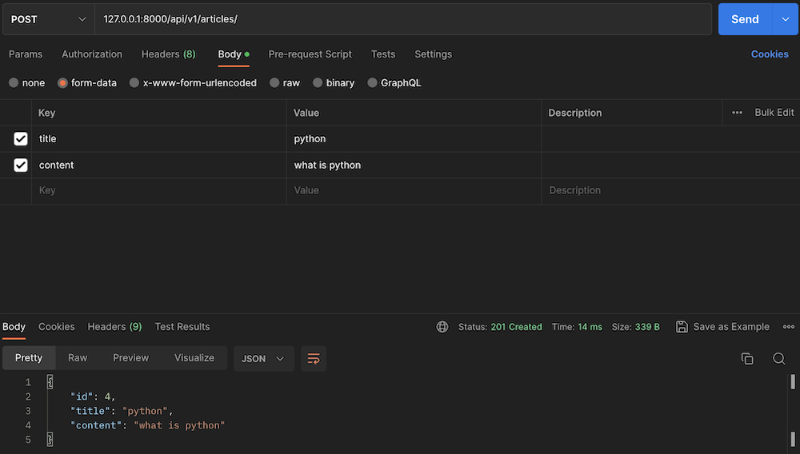
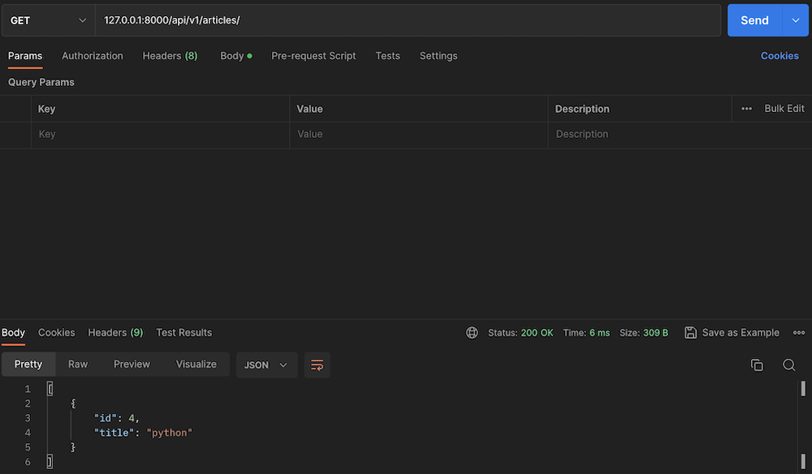
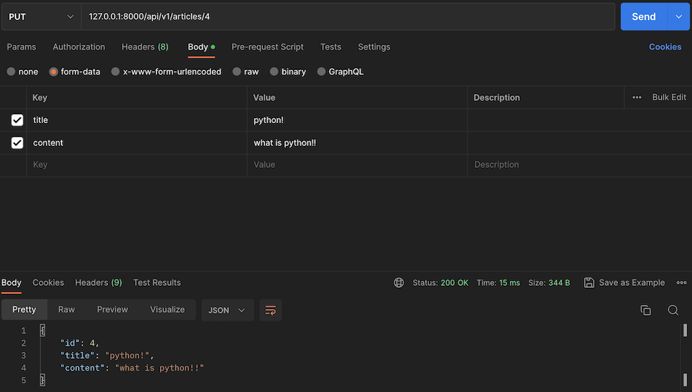
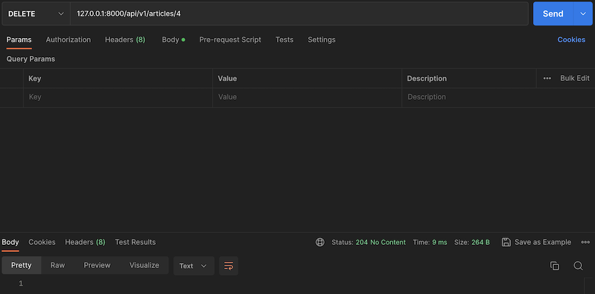

# Django Rest Framework

## Rest (Representational State Transfer)

API Server 개발을 위한 일종의 소프트웨어 설계 방법론

자원을 정의하고 자원에 대한 주소를 지정하는 전반적인 방법 서술

1. 자원 식별
    - URI
2. 자원 행위
    - HTTP Methods
3. 자원 표현
    - JSON 등 최종적으로 표현되는 결과물 (데이터)

## Rest API

Rest 라는 API 디자인 아키텍처를 구현한 API

## DRF Single Model

HTTP Method

- POST : Create
- GET : Read
- PUT : Update
- Delete : Delete

```python
# config/urls.py

from django.contrib import admin
from django.urls import path, include

urlpatterns = [
    path('admin/', admin.site.urls),
    path('api/v1/articles/', include('articles.urls')),
]
```

```python
# articles/urls.py

from django.urls import path
from . import views

urlpatterns = [
    path('', views.article_list),
    path('<int:article_pk>', views.article_detail),
]
```

```python
# articles/models.py

from django.db import models


class Article(models.Model):
    title = models.CharField(max_length=50)
    content = models.TextField()

```

```python
# articles/serializers.py

from rest_framework import serializers
from .models import Article


class ArticleSerializer(serializers.ModelSerializer):
    class Meta:
        model = Article
        fields = '__all__'


class ArticleListSerializer(serializers.ModelSerializer):
    class Meta:
        model = Article
        fields = ('id', 'title',)
```

```python
# articles/views.py

from django.shortcuts import render
from rest_framework.response import Response
from rest_framework.decorators import api_view
from .models import Article
from . serializers import ArticleSerializer, ArticleListSerializer
from rest_framework import status


@api_view(['GET', 'POST'])
def article_list(request):
    if request.method == 'GET':
        articles = Article.objects.all()
        serializer = ArticleListSerializer(articles, many=True)
        return Response(serializer.data)
    elif request.method == 'POST':
        serializer = ArticleSerializer(data=request.data)
        if serializer.is_valid(raise_exception=True):
            serializer.save()
            return Response(serializer.data, status=status.HTTP_201_CREATED)


@api_view(['GET', 'DELETE', 'PUT'])
def article_detail(request, article_pk):
    article = Article.objects.get(pk=article_pk)
    if request.method == 'GET':
        serializer = ArticleSerializer(article)
        return Response(serializer.data)
    elif request.method == 'DELETE':
        article.delete()
        return Response(status=status.HTTP_204_NO_CONTENT)
    elif request.method == 'PUT':
        serializer = ArticleSerializer(article, data=request.data)
        if serializer.is_valid(raise_exception=True):
            serializer.save()
            return Response(serializer.data)
```

## API Test

```cmd
python manage.py makemigrations
python manage.py migrate
python manage.py runserver
```

Postman 활용 (https://www.postman.com/)

### POST



### GET



### PUT



### DELETE


