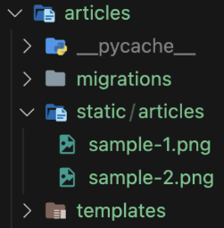
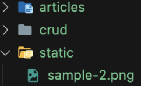

# Django Static Files

서버에서 제공되는 이미지, JS, CSS 등의 파일

## 기본 경로

app/static



```html
<!-- articles/index.html -->




```

## 추가 경로

```python
# settings.py

STATICFILES_DIRS = [
    BASE_DIR / 'static',
]
# 추가 경로 목록을 정의하는 리스트
```



```html
<!-- articles/index.html -->




```
