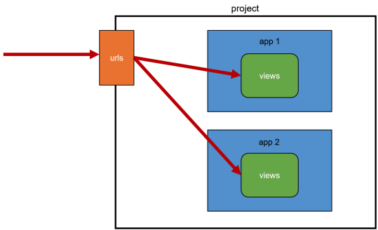
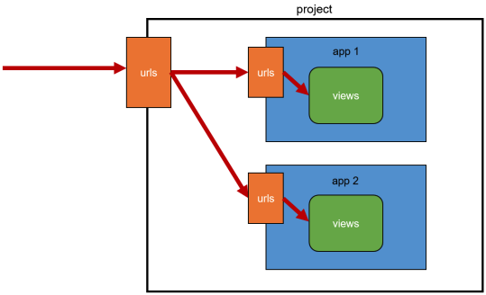

# Django URL

## URL Dispatcher

URL 패턴을 정의하고 해당 패턴이 일치하는 요청을 처리할 view 함수를 매핑

### Variable Routing

URL 일부에 변수를 포함

### Path Converters

URL 변수 타입 지정

- str - Matches any non-empty string, excluding the path separator, '/'. This is the default if a converter isn’t included in the expression.
- int - Matches zero or any positive integer. Returns an int.
- slug - Matches any slug string consisting of ASCII letters or numbers, plus the hyphen and underscore characters. For example, building-your-1st-django-site.
- uuid - Matches a formatted UUID. To prevent multiple URLs from mapping to the same page, dashes must be included and letters must be lowercase. For example, 075194d3-6885-417e-a8a8-6c931e272f00. Returns a UUID instance.
- path - Matches any non-empty string, including the path separator, '/'. This allows you to match against a complete URL path rather than a segment of a URL path as with str.

https://docs.djangoproject.com/en/3.2/topics/http/urls/

```python
# urls.py

urlpatterns = [
    path('articles/<int:num>/', views.detail),
]
```

```python
# views.py

def detail(request, num):
    context = {
        'num': num,
    }
    return render(request, 'articles/detail.html', context)
```

```html
<!-- articles/detail.html -->




  <h1>{{ num }}</h1>

```

## App URL

App 별로 URL 정의

As-is



To-be



```python
# Proejct/urls.py

from django.urls import path, include

urlpatterns = [
    path('articles/', include('articles.urls')),
    path('pages/', include('pages.urls')),
]
```

```python
# articles/urls.py

from django.urls import path
from . import views

urlpatterns = [
    path('index/', views.index),
    path('dinner/', views.dinner),
]
```

```python
# pages/urls.py

from django.urls import path
from . import views

urlpatterns = [
    path('index/', views.index),
    path('hello/<srt:name>/', views.hello),
]
```

## Naming URL Patterns

URL 에 이름 지정

```python
# articles/urls.py

from django.urls import path
from . import views

urlpatterns = [
    path('index/', views.index, name='index'),
    path('dinner/', views.dinner, name='dinner'),
]
```

As-is

```html
<!-- articles/index.html -->




  <a href="/dinner/">dinner</a>

```

To-be

```html
<!-- articles/index.html -->




  <a href="">dinner</a>

```

### Naming 중복

서로 다른 앱에서 url 중복이 생길 경우 

As-is

```python
# articles/urls.py

path('index/', views.index, name='index'),
```

```python
# pages/urls.py

path('index/', views.index, name='index'),
```

To-be

```python
# articles/urls.py

app_name = 'articles'
urlpatterns = [
    path('index/', views.index, name='index'),
]
```

```python
# pages/urls.py

app_name = 'pages'
urlpatterns = [
    path('index/', views.index, name='index'),
]
```

```html



  <a href="">dinner</a>

```
