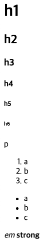
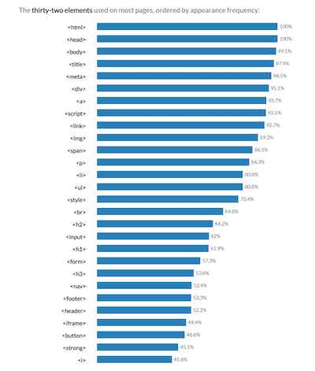

# HTML (HyperText Markup Language)

## HTML 이란

웹 페이지 표시를 위해 개발된 지배적인 마크업 언어

HTML은 제목, 단락, 목록 등과 같은 본문을 위한 구조적 의미를 나타내는 것뿐만 아니라 링크, 인용과 그 밖의 항목으로 구조적 문서를 만들 수 있는 방법을 제공

꺾쇠 괄호에 둘러싸인 태그로 되어있는 HTML 요소 형태로 작성

HTML 은 웹 브라우저와 같은 HTML 처리 장치의 행동에 영향을 주는 자바스크립트, 본문과 그 밖의 항목의 외관과 배치를 정의하는 CSS 같은 스크립트를 포함하거나 불러올 수 있음

## HTML Element

```html
<p>HTML is HyperText Markup Language</p>
<!-- <p> : tag -->
<!-- HTML is HyperText Markup Language : content -->
```

닫는 태그가 없는 경우도 있음

## HTML Attribute

```html
<p class="editor-note">HTML is HyperText Markup Language</p>
<!-- class="editor-note" : attribute -->
```

공백으로 구분하며 0개 또는 여러 개 적용 가능

## HTML 구조

```html
<!-- html 문서라는 것을 표시 -->
<!DOCTYPE html> 

<!-- 전체 페이지의 콘텐츠 -->
<html lang="en">

<!-- html 문서에 대한 설명, 설정 등 -->
<head>
    <!-- 브라우저 탭 및 즐겨찾기 시 표시되는 부분 -->
    <title>Hello</title>
</head>
<!-- 페이지에 표시되는 모든 콘텐츠 -->
<body>
    <p>content</p>
</body>
</html>
```

## HTML Text Structure

- Heading : h1 ~ h6
- Paragraphs : p
- Lists : ol, ul, li
- Emphasis : em
- Importance : strong

```html
<h1>h1</h1>
<h2>h2</h2>
<h3>h3</h3>
<h4>h4</h4>
<h5>h5</h5>
<h6>h6</h6>

<p>p</p>

<ol>
    <li>a</li>
    <li>b</li>
    <li>c</li>
</ol>

<ul>
    <li>a</li>
    <li>b</li>
    <li>c</li>
</ul>

<em>em</em>

<strong>strong</strong>
```



## 자주 사용되는 태그 순위


