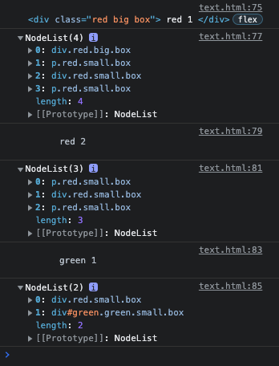

# Javascript

## Javascript 란

웹 페이지에서 복잡한 기능을 구현할 수 있도록 하는 스크립팅 언어 또는 프로그래밍 언어

### 값 출력

```html
<!DOCTYPE html>
<html lang="en">
<head>
  <meta charset="UTF-8">
  <meta http-equiv="X-UA-Compatible" content="IE=edge">
  <meta name="viewport" content="width=device-width, initial-scale=1.0">
  <title>Document</title>
</head>
<body>
  <script>
    console.log('hello')
  </script>
</body>
</html>
```

```
hello
```

### 요소 선택

document.querySelector(selector) : selector 와 일치하는 element 한 개 선택

document.querySelectorAll(selector) : selector 와 일치하는 element 모두 선택

```html
<!DOCTYPE html>
<html lang="en">

<head>
  <meta charset="UTF-8">
  <meta http-equiv="X-UA-Compatible" content="IE=edge">
  <meta name="viewport" content="width=device-width, initial-scale=1.0">
  <title>JavaScript DOM</title>
  <style>
    .box {
      display: flex;
      justify-content: center;
      align-items: center;
      flex-wrap: wrap;
    }

    .big {
      margin: 1rem;
      padding: 1rem;
      font-size: 2rem;
      font-weight: 900;
      height: 300px;
      width: 300px;
    }

    .small {
      margin: 0.5rem;
      padding: 0.5rem;
      font-size: 1rem;
      font-weight: 900;
      height: 75px;
      width: 75px;
    }

    .blue {
      background-color: lightblue;
    }

    .green {
      background-color: lightgreen;
    }

    .red {
      background-color: lightcoral;
    }
  </style>
</head>

<body>
  <div>
    <div class="red big box">
      red 1
    </div>
    <div class="blue big box">
      <p class="red small box">
        red 2
      </p>
      <div class="red small box">
        red 3
      </div>
      <div id="green" class="green small box">
        green 1
      </div>
      <p class="red small box">
        red 4
      </p>
    </div>
    <div class="green big box">
      green 2
    </div>
  </div>
</body>

<script>
  console.log((document.querySelector('.red')))

  console.log(document.querySelectorAll('.red'))

  console.log(document.querySelector('p.red').textContent)

  console.log(document.querySelectorAll('.red.small'))

  console.log(document.querySelector('#green').textContent)

  console.log(document.querySelectorAll('div.small'))

</script>

</html>
```



### 클래스 추가

element.classList.add() : element 에 클래스 추가

element.classList.remove() : element 에 클래스 제거

```html
<!DOCTYPE html>
<html lang="en">

<head>
  <meta charset="UTF-8">
  <meta http-equiv="X-UA-Compatible" content="IE=edge">
  <meta name="viewport" content="width=device-width, initial-scale=1.0">
  <title>JavaScript DOM</title>
  <style>
    .box {
      height: 300px;
      width: 300px;
      display: inline-flex;
      justify-content: center;
      align-items: center;
      font-size: 2rem;
      font-weight: 900;
      margin: 1rem
    }

    .blue {
      background-color: lightblue;
    }

    .green {
      background-color: lightgreen;
    }

    .red {
      background-color: lightcoral;
    }

    .black {
      background-color: black;
    }

    .pink {
      background-color: lightpink;
    }

    .circle {
      border-radius: 50%;
    }

    .border-2 {
      border-width: 2px;
    }

    .border-dashed {
      border-style: dashed;
    }

    .border-black {
      border-color: black;
    }
  </style>
</head>

<body>
  <div>
    <div class="blue">blue</div>
    <div class="box green box2">green</div>
    <div class="box red">black</div>
    <div id="yellow" class="box">yellow</div>
    <div class="box black">black</div>
    <div id="pink">pink</div>
  </div>
</body>

<script>
  document.querySelector('.blue').classList.add('box')

  document.querySelector('.box2').classList.remove('box2')

  document.getElementById('pink').classList.add('box', 'pink', 'circle', 'border-2', 'border-dashed', 'border-black')

</script>

</html>
```

### 속성 조작

element.getAttribute() : 요소에 지정한 값 반환

element.setAttribute() : 요소에 지정한 값 설정

element.removeAttribute() : 요소에 지정한 값 제거

### 요소 조작

element.createElement() : 생성

element.appendChild() : 추가

element.removeChild() : 삭제

### 함수

#### 선언식

```javascript
function funcName () {
  statement
}
```

#### 표현식

```javascript
const funcName = function () {
  statement
}
```

#### 기본 함수 매개변수

```javascript
const greeting = function (name = 'Anonymous') {
  return `Hi ${name}`
}

greeting()  // Hi Anonymous
```

#### 화살표 함수 표현식

```javascript
const arrow1 = function (name) {
  return 'hello'
}

const arrow2 = (name) => { return 'hello' }

// 같은 코드
```
